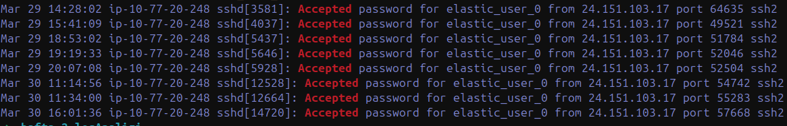

# auth2.log: When the Raw Counts Lie

> **Scope note.** Week 2, Scenario 1, on a second and larger log (`auth2.log`,
> 7,121 lines). Eight questions, each answered with the command and its output so
> every result is reproducible in a terminal. The real lesson is in the counting:
> raw syslog numbers are not directly trustworthy.

---

## 1. Summary

This report examines the SSH authentication events in `auth2.log` across 8 questions.
Every answer is given with the command used and its output, so each result can be
reproduced.

Two technical details had to be accounted for to make the counts correct:

- **`message repeated`:** when the same line repeats consecutively, syslog collapses
  it into a single "message repeated N times" line. If those lines aren't counted N
  times, failed-attempt totals come out short (e.g. root: 211 raw, 532 real). So the
  counts were expanded with `gawk`.
- **`invalid user`:** in "Failed password for invalid user X" lines, the real username
  (X) comes *after* "invalid user". The regex was tuned to skip that prefix.

### 1.1 Answers at a Glance

| Question | Answer |
| :--- | :--- |
| Q1 — publickey login | `ubuntu` (36 records) |
| Q2 — most-attempted user | `root` (532 attempts) |
| Q3 — most-attempting IP | `24.151.103.17` (157 attempts) |
| Q4 — scripted accounts | `elastic_user_0–9` (10, 29 Mar 10:36) |
| Q5 — login after heavy attempts | `24.151.103.17` → `elastic_user_0`, 30 Mar 16:01:36 |
| Q6 — top IP attacking root | `49.4.143.105` (120 attempts, all failed) |
| Q7 — most-attempted invalid user | `admin` (141 attempts) |
| Q8 — localhost login | `elastic_user_7`, 29 Mar 10:43:01 |

---

## 2. Getting to Know the File

Before the questions, the file's overall structure was surveyed:

```bash
wc -l auth2.log        # 7121 lines
head -1 / tail -1      # 27 Mar – 20 Apr
# process distribution (PIDs stripped):
awk '{print $5}' auth2.log | sed -E 's/\[[0-9]+\]//' | sort | uniq -c | sort -rn
```

```
   4095 sshd:
    557 sudo:
    417 chpasswd:
   1264 CRON:
    452 systemd-logind:
     50 useradd:
      3 groupadd:
```

`sshd` is the dominant process and the main source for the SSH questions. `useradd` +
`groupadd` + `chpasswd` appearing together points to scripted bulk user creation (Q4).
`CRON` records are unrelated to authentication and were filtered out as noise.

---

## 3. Questions and Answers

### Question 1 — Login Without a Password

**Q:** Which user accessed SSH without a password, and by what method?

```bash
grep "Accepted publickey" auth2.log | grep -oP "for \K\S+" | sort | uniq -c
# 36 ubuntu
```

> **Answer:** `ubuntu` — via publickey (SSH key). All 36 publickey records in the file
> belong to this user; the regular usage suggests a management/automation account.

### Question 2 — Most-Failed User

**Q:** Which user had the most failed SSH login attempts, and how many?

The `gawk` pattern (with message-repeated expansion) was used:

```bash
grep "Failed password" auth2.log | gawk '
{
  if (match($0,/message repeated ([0-9]+) times/,m)) {n=m[1]} else {n=1}
  match($0,/for (invalid user )?([^ ]+) from/,u)
  for (i=0;i<n;i++) print u[2]
}' | sort | uniq -c | sort -rn
```

```
    532 root
    148 elastic_user_0
    141 admin
```

> **Answer:** `root` — 532 failed attempts. (Without the message-repeated fix this
> showed as 211.) As the account guaranteed to exist on every system, root is the
> attackers' primary target.

### Question 3 — Most-Attempting IP

**Q:** Which IP made the most failed SSH attempts? (The IP variant of the gawk pattern —
capturing `from ... port`.)

```bash
grep "Failed password" auth2.log | gawk '
{
  if (match($0,/message repeated ([0-9]+) times/,m)) {n=m[1]} else {n=1}
  match($0,/from (\S+) port/,ip)
  for (i=0;i<n;i++) print ip[1]
}' | sort | uniq -c | sort -rn | head
```

```
    157 24.151.103.17
    120 49.4.143.105
     43 34.204.227.175
```

> **Answer:** `24.151.103.17` — 157 attempts, the most active IP. (Note: the runner-up
> `49.4.143.105` is the answer to Q6 — a different IP.)

### Question 4 — Scripted Accounts

**Q:** Which accounts were bulk-created (by script), how many, and when?

```bash
grep "new user" auth2.log
```

```
Mar 29 10:36:43 useradd[750]: new user: name=elastic_user_0, UID=1001 ...
... (continues with sequential names and UIDs)
Mar 29 10:36:44 useradd[840]: new user: name=elastic_user_9, UID=1010 ...
```

> **Answer:** `elastic_user_0` – `elastic_user_9` (10 accounts), 29 Mar 10:36:43–44
> (within 1 second). Sequential names + sequential UIDs (1001–1010) + a one-second
> window = a script signature.

### Question 5 — Successful Login After Heavy Attempts

**Q:** An IP logged in successfully to a user after heavy attempts. What are the IP,
user, and date?

The most active IP (24.151.103.17) targeted `elastic_user_0`. Its failed attempts
against this account — count, start/end, and the immediately following success — were
examined:

```bash
grep "elastic_user_0" auth2.log | grep "24.151.103.17" | grep "Failed" | wc -l
grep "elastic_user_0" auth2.log | grep "24.151.103.17" | grep "Failed" | head -1
grep "elastic_user_0" auth2.log | grep "24.151.103.17" | grep "Failed" | tail -1
```

```
147   (total failed attempts)
First: Mar 30 15:54:19 Failed password for elastic_user_0 from 24.151.103.17
Last:  Mar 30 16:01:35 Failed password for elastic_user_0 from 24.151.103.17
Then:  Mar 30 16:01:36 Accepted password for elastic_user_0 from 24.151.103.17
```

> **Answer:** IP `24.151.103.17`, user `elastic_user_0`, successful login 30 Mar
> 16:01:36. 147 failed attempts (15:54–16:01, ~7 min) were immediately followed by a
> success.

**Note:** This IP also has *earlier* successful logins to `elastic_user_0` (the command
below shows 8 Accepted records, 7 of them before the brute-force). So this isn't a
from-scratch password crack; it can be read as re-access after a probable password
change. The IP/user/date triple asked for is as above.

```bash
grep "elastic_user_0" auth2.log | grep "24.151.103.17" | grep "Accepted"
```


*Eight accepted logins for elastic_user_0 from this IP — 7 precede the brute-force window.*

### Question 6 — Top IP Attacking root

**Q:** Which IP made the most failed logins to root? (Filter restricted to root.)

```bash
grep "Failed password for root" auth2.log | gawk '
{
  if (match($0,/message repeated ([0-9]+) times/,m)) {n=m[1]} else {n=1}
  match($0,/from (\S+) port/,ip)
  for (i=0;i<n;i++) print ip[1]
}' | sort | uniq -c | sort -rn | head
grep "49.4.143.105" auth2.log | grep "Accepted"   # → (empty, none)
```

```
    120 49.4.143.105
     24 201.178.81.113
     15 221.194.44.190
```

> **Answer:** `49.4.143.105` — 120 attempts, the top IP attacking root; none of them
> succeeded. It's a *different* IP from Q3's `24.151.103.17`.

### Question 7 — Most-Attempted Invalid User

**Q:** Among accounts not defined on the system (invalid user), which was attempted most?

```bash
grep "Failed password for invalid user" auth2.log | grep -oP "invalid user \K\S+" | sort | uniq -c | sort -rn | head -3
```

```
    141 admin
     33 ubnt
     24 pi
```

> **Answer:** `admin` — 141 attempts. Names like `admin`/`ubnt`/`pi` are IoT and
> default-device accounts; none is defined on the system (automated scanning traffic).

### Question 8 — localhost (127.0.0.1) Login

**Q:** Who logged in via SSH over localhost, and when?

```bash
grep "127.0.0.1" auth2.log | grep "Accepted"
```

```
Mar 29 10:43:01 sshd[1193]: Accepted password for elastic_user_7 from 127.0.0.1 port 52942
```

> **Answer:** `elastic_user_7` logged in with a password over localhost (127.0.0.1) at
> 29 Mar 10:43:01.

A localhost login means the connection came from the machine itself, not the network —
usually a service/script connecting to itself, or a local test.

---

## 4. Additional Observations

- **Empty-username scanning:** 43 attempts from `34.204.227.175` with a completely empty
  username field ("invalid user from"). Carrying no name, it was excluded from Q7 — it's
  a separate scanning behaviour.
- **Distributed campaign against root:** beyond `49.4.143.105`, many different IPs made
  dozens of attempts each against root; all failed. This suggests direct SSH login as
  root is disabled, or the password is strong.
- **Config note:** the SSH service listens on port 2222 rather than the standard port 22
  (from the connection line in Q8).

---

## 5. Conclusion

The file holds three distinct kinds of event:

- **Legitimate traffic:** `ubuntu` (publickey management logins) and the routine logins
  of the `elastic_user` accounts.
- **Successful access:** `24.151.103.17` logging into `elastic_user_0` after 147
  attempts, at 30 Mar 16:01:36 (Q5).
- **Failed attacks + noise:** distributed attempts against root (Q6) and invalid-user
  scanning traffic (Q7).

> **Methodological lesson.** Raw log counts are not directly reliable. Numbers obtained
> without fixing the `message repeated` and `invalid user` traps (211 for root) were
> misleading; after the fix, the true values (root 532) emerged. Every number is
> documented with the command that produced it.

**Priority recommendation:** the `elastic_user_0` account's password should be
changed/suspended, `24.151.103.17` should be blocked, and the session activity after
that login (sudo, command history) should be examined separately.
