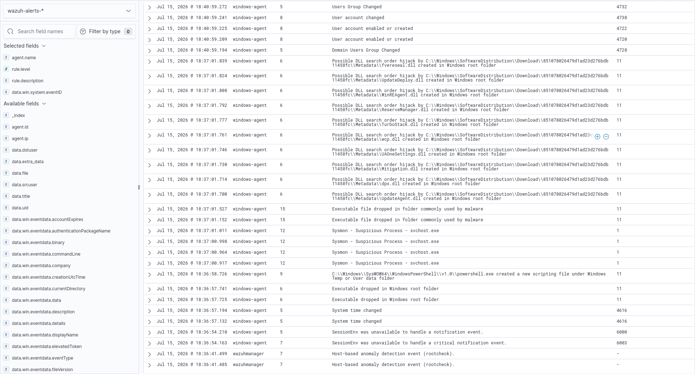
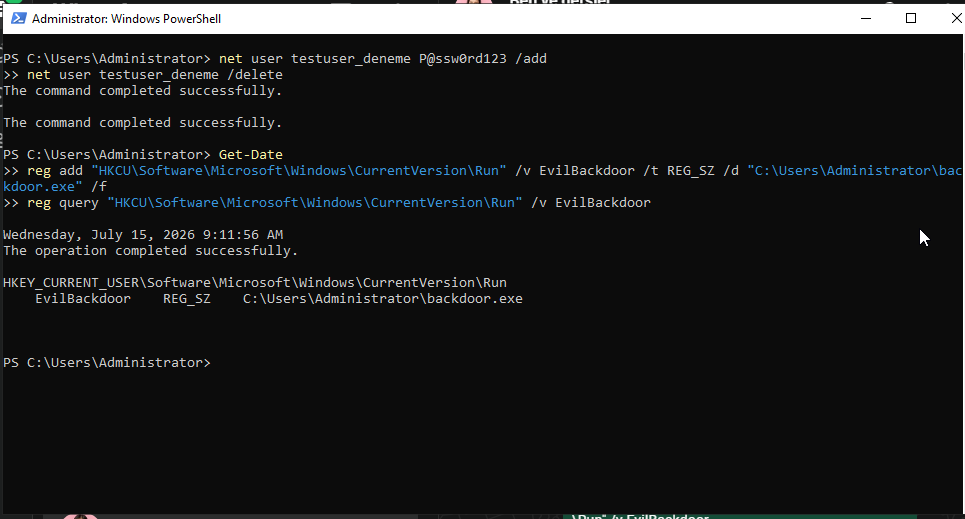
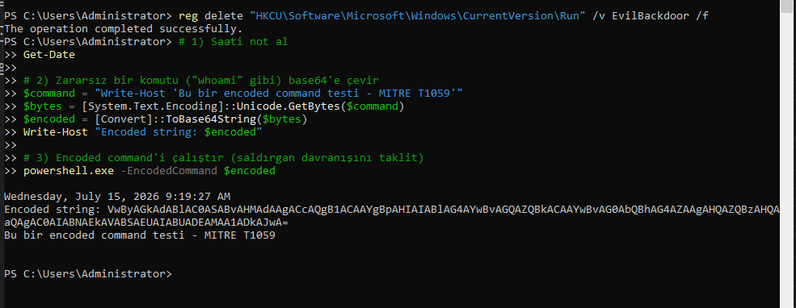
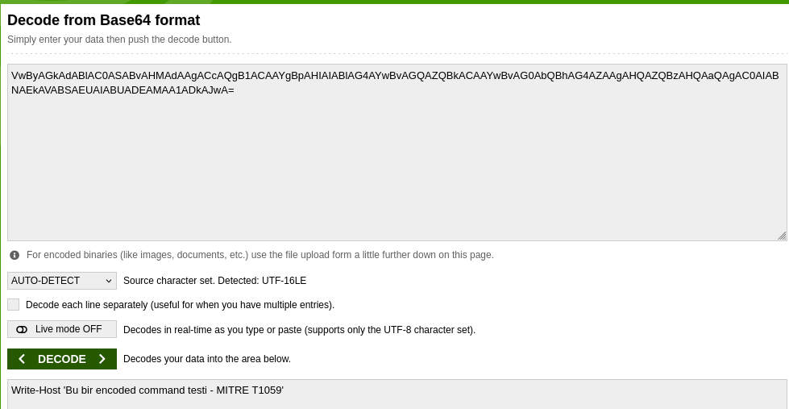
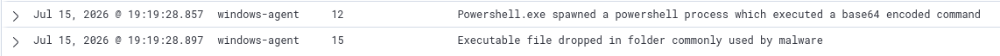
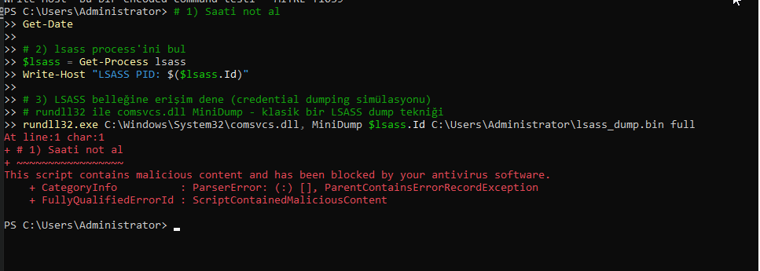
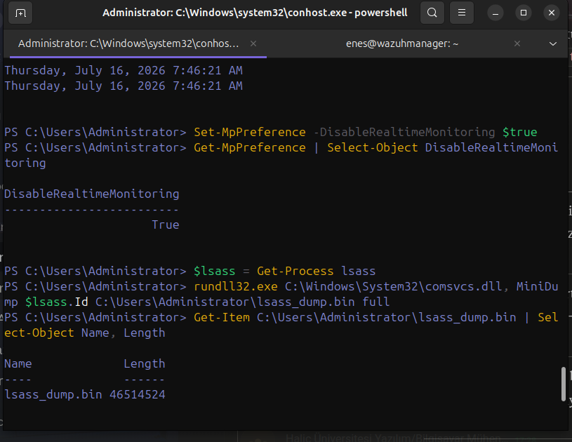
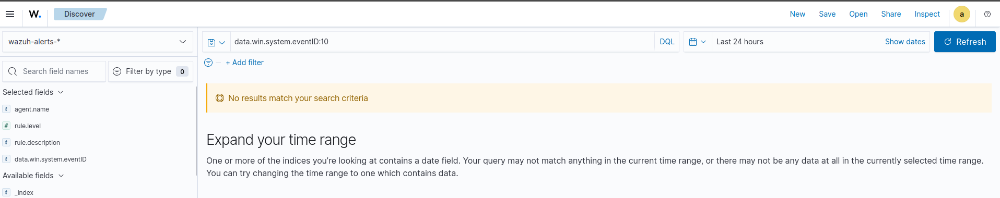

# Triaging Windows Attacks in Wazuh: Where rule.level Lies

> **Scope note.** This is week 2 of a SOC analyst internship. Four attack
> techniques were simulated in a controlled lab, captured by Sysmon, forwarded to
> Wazuh, and triaged the way an L1 analyst would work a real queue: reproduce,
> locate, inspect, decide, document.

---

## 1. Executive Summary

This report covers "Scenario 2: investigating suspicious activity in Windows Event
Log and Sysmon records." The work was carried out in the Wazuh lab built the
previous week (Manager + Linux/Windows agent + Sysmon + Suricata). The goal was to
simulate real attack techniques in a controlled way, ensure Sysmon captured them
and forwarded them to Wazuh, and triage the resulting alerts like a SOC L1 analyst.

Four scenarios were run, and together they span the full decision spectrum of a
real SOC evaluation: correctly detecting a genuine threat (**True Positive**), a
harmless event producing a high-severity **False Positive**, and a critical attack
that went entirely undetected (**Detection Gap**). That variety is the report's
central thesis: **`rule.level` alone does not determine whether an event is a real
threat** — the analyst must read the context and verify the evidence chain.

### 1.1 Results at a Glance

| Scenario | Technique | MITRE | Triage verdict |
| :--- | :--- | :--- | :--- |
| A | Registry Run Key persistence | T1547.001 | **TRUE POSITIVE** (rule 92302, lvl 6) |
| B | Encoded PowerShell (obfuscation) | T1059.001 | **TRUE POSITIVE** (rule 92057, lvl 12) |
| B-side | PSScriptPolicyTest file | — | **FALSE POSITIVE** (lvl 15 but benign) |
| C | LSASS credential dumping | T1003.001 | **DETECTION GAP** (not detected) |

---

## 2. Lab Environment and Data Flow

The environment is the KVM-based Wazuh lab from the previous week. The Windows agent
(`192.168.122.81`, hostname `WIN-U4KI1MI7UR7`) runs Sysmon, and events are forwarded
to the Wazuh Manager. Before generating any activity, the pipeline was verified
end-to-end across three layers:

- **Layer 1 — Is Sysmon running?** `Get-Service Sysmon64` (Running) and a live event
  stream via `Get-WinEvent`; Event ID 1 (Process Create) and 11 (File Create) records
  appeared with current timestamps.
- **Layer 2 — Is the agent forwarding?** The `Microsoft-Windows-Sysmon/Operational`
  channel is defined as a `<localfile>` in `ossec.conf`, and the `WazuhSvc` service is
  Running.
- **Layer 3 — End-to-end test.** A user-creation event (`net user`) generated on
  Windows reached the Manager's `alerts.log` and the Dashboard — confirming the full
  Sysmon → agent → Manager → Dashboard chain.

```
Windows activity → Sysmon (Event Log) → Wazuh Agent → Wazuh Manager (decoder + rule engine) → Dashboard (alert)
```

> ⚙ **Methodology note.** Two setup details worth recording: SSH was installed on a
> non-standard port on the Windows side and used (via OpenSSH) to run commands
> directly and speed up the investigation; and Dashboard searches (OpenSearch-based)
> required DQL syntax (e.g. `data.win.system.eventID:10`) rather than plain
> keyword search.


*Discover overview: generated activity by rule.level.*

---

## 3. Triage Methodology

Every scenario followed the same five-step triage loop, which keeps decisions
consistent and justified:

1. **Generate** — run a controlled, harmless activity that mimics attacker behaviour; record the timestamp (`Get-Date`).
2. **Locate** — find the alert in the Dashboard by time range and DQL query (e.g. a unique `rule.id`).
3. **Inspect** — read `rule.id`, `rule.level`, `rule.mitre.id`, and the raw Sysmon fields (`image`, `targetObject`, `commandLine`, …).
4. **Decide** — justify a True Positive / False Positive / Detection Gap verdict from context and evidence.
5. **Document** — capture the command output and alert detail as a screenshot.

> **`rule.level` scale (reference).** Wazuh assigns each rule a level from 0–16.
> `0` = not an alert (logging), `1–3` = low, `4–6` = medium, `7–11` = high,
> `12–14` = critical, `15` = highest. But as this work shows, a high level does
> **not** by itself mean a real threat (see Scenario B-side).

---

## 4. Scenario Findings

### Scenario A — Registry Run Key Persistence (T1547.001)

**Goal & technique.** This simulates one of the most common persistence techniques:
adding a program to the registry `Run` key so it launches every time Windows starts.
To make the malicious intent unmistakable, a fake entry named `EvilBackdoor`
targeting `backdoor.exe` was created.

**Activity generated:**

```powershell
reg add "HKCU\Software\Microsoft\Windows\CurrentVersion\Run" /v EvilBackdoor /t REG_SZ /d "C:\Users\Administrator\backdoor.exe" /f
reg query "HKCU\Software\Microsoft\Windows\CurrentVersion\Run" /v EvilBackdoor
```

The output showed the entry added successfully ("The operation completed
successfully") and confirmed via `reg query`. Time: 15 July 09:11:56.


*The EvilBackdoor Run key is added and verified.*

**Wazuh detection.** Sysmon captured this as Event ID 13 (Registry Value Set), and
Wazuh fired two rules. The one that matters for persistence detection:

| Field | Value |
| :--- | :--- |
| `rule.id` | 92302 |
| `rule.level` | 6 |
| `rule.description` | Registry entry to be executed on next logon was modified using command line application reg.exe |
| `rule.mitre.id` | T1547.001 |
| `rule.mitre.tactic` | Persistence, Privilege Escalation |
| `rule.mitre.technique` | Registry Run Keys / Startup Folder |
| `eventID` | 13 (Registry Value Set) |
| `targetObject` | `...\CurrentVersion\Run\EvilBackdoor` |
| `details` | `C:\Users\Administrator\backdoor.exe` |
| `image` | `C:\Windows\system32\reg.exe` |
| `ruleName` (Sysmon) | `T1060,RunKey` |

> **Verdict: TRUE POSITIVE.**
> (1) The behaviour is objectively suspicious — an executable was added to a
> registry Run key to launch at every boot, the classic persistence method.
> (2) The context does not match any legitimate process: the `EvilBackdoor` value
> name and `backdoor.exe` target are no real software's behaviour.
> (3) The evidence chain is complete: who (Administrator), with what tool
> (`reg.exe`), what (`Run\EvilBackdoor`), and with what value (`backdoor.exe`).
> Note also that Sysmon's own `ruleName` tagged the event `T1060,RunKey` — MITRE's
> **old** ID for this technique (now T1547.001); the Sysmon config references an
> older ID, but the technique is the same.

---

### Scenario B — Encoded PowerShell / Obfuscation (T1059.001)

**Goal & technique.** Real attackers Base64-encode PowerShell to hide what they run
(defense evasion / obfuscation) and execute it with `-EncodedCommand`. Here a harmless
`Write-Host` was Base64-encoded and run encoded — so the content stays harmless while
the behaviour exactly mimics the attacker technique.

**Activity generated:**

```powershell
$command = "Write-Host '...test - MITRE T1059'"
$bytes = [System.Text.Encoding]::Unicode.GetBytes($command)
$encoded = [Convert]::ToBase64String($bytes)
powershell.exe -EncodedCommand $encoded
```

An encoded string (`VwByAGkAdABlAC0...`) was produced and run via
`powershell.exe -EncodedCommand`. Time: 15 July 09:19:27.


*Encoding, then executing with -EncodedCommand.*

**Wazuh detection.** Sysmon captured this as Event ID 1 (Process Create), and Wazuh
produced:

| Field | Value |
| :--- | :--- |
| `rule.id` | 92057 |
| `rule.level` | 12 |
| `rule.description` | Powershell.exe spawned a powershell process which executed a base64 encoded command |
| `rule.mitre.id` | T1059.001 |
| `rule.mitre.tactic` | Execution |
| `eventID` | 1 (Process Create) |
| `commandLine` | `powershell.exe -EncodedCommand VwByAGkAdABlAC0...` |
| `integrityLevel` | High |
| `hashes` | MD5/SHA256/IMPHASH present |

**Methodology step — decode the Base64.** The alert says "a base64 encoded command was
executed" but not *what* was executed. Correct triage is to decode the string and
verify the content — because in a real attack a downloader/executor could be hiding
behind that Base64. Decoding the `commandLine` string confirmed a harmless `Write-Host`:

```
[System.Text.Encoding]::Unicode.GetString([Convert]::FromBase64String($enc))
→ Write-Host 'Bu bir encoded command testi - MITRE T1059'
```


*Decoded: the payload is a benign Write-Host.*

> **Verdict: TRUE POSITIVE.**
> (1) Hiding a command with Base64 and running it via `-EncodedCommand` is a classic
> evasion technique; Wazuh correctly assigned level 12.
> (2) But "being encoded" alone is not conclusive malice — some legitimate admin
> scripts use encoding too. That is exactly why correct triage decodes and verifies
> the content. Here the content was benign, but methodologically the analyst must not
> skip this step.
> (3) What separates this from Scenario A is that detection is not enough — the
> obfuscated content had to be revealed. A mature triage reflex.

---

### Scenario B-side — PSScriptPolicyTest (A False Positive)

At the same moment as the encoded-PowerShell alert (19:19:28), **another** alert fired
at **level 15** — Wazuh's highest: *"Executable file dropped in folder commonly used by
malware"* (Event ID 11, File Create). At first glance this looks like a critical threat.


*Two alerts, same second: level 12 (TP) and level 15 (FP).*

**Inspection.** The alert's `targetFilename` shows the created file is of the form
`__PSScriptPolicyTest_<random>.ps1`. This is an internal system file that PowerShell
writes to the Temp folder — and immediately deletes — on every launch to test the
execution policy. It is entirely legitimate and routine. The creating process is also
the legitimate `powershell.exe` on the system path.

> **Verdict: FALSE POSITIVE.** Despite being level 15 (highest), the created file is a
> product of PowerShell's own internal mechanism, not a malicious "executable drop." It
> fired as a side effect of running the encoded command in a PowerShell window (Scenario
> B). This is the most concrete proof of the report's thesis: **a high alert level does
> not automatically mean a real threat** — the analyst must read contextual evidence
> (`targetFilename`, `image`, the file path) to decide.

---

### Scenario C — LSASS Credential Dumping (T1003.001) — DETECTION GAP

**Goal & technique.** `lsass.exe` (Local Security Authority Subsystem) holds logged-on
users' credentials in memory. Attackers dump that memory to steal passwords/hashes
(credential dumping, T1003.001). Here, instead of downloading an external tool
(Mimikatz), Windows' own `comsvcs.dll` `MiniDump` function was used — the "living off
the land" approach modern attackers prefer.

**Phase 1 — Prevention layer (Defender/AMSI).** On the first attempt, the command was
blocked by Windows Defender / AMSI before it even ran:

```
rundll32.exe C:\Windows\System32\comsvcs.dll, MiniDump $lsass.Id C:\Users\Administrator\lsass_dump.bin full
→ This script contains malicious content and has been blocked by your antivirus software.
  FullyQualifiedErrorId : ScriptContainedMaliciousContent
```

> **Note.** This block happened at the **AMSI** (Antimalware Scan Interface) layer,
> during script parsing. Inspecting the Windows Defender Operational log (Event ID
> 1116/1117) showed **no** malware-detection record for this block — because AMSI blocks
> are not written to the process/file-based Defender log channel. The prevention layer
> engaged so early that the event reached neither Sysmon (no process was created) nor
> Defender's process-based log.


*Phase 1: blocked at the AMSI layer before execution.*

**Phase 2 — Detection test (Defender off).** To stop the prevention layer from
shadowing detection — and to test purely whether Sysmon captures the LSASS access —
Defender real-time protection was temporarily disabled, the command re-run, and
protection re-enabled immediately after. This time the command succeeded and an LSASS
memory dump was taken:

```powershell
Set-MpPreference -DisableRealtimeMonitoring $true    # protection off
rundll32.exe ... comsvcs.dll, MiniDump $lsass.Id lsass_dump.bin full
Get-Item lsass_dump.bin | Select Name, Length
→ lsass_dump.bin  46514524   (~46 MB — dump succeeded)
Set-MpPreference -DisableRealtimeMonitoring $false   # protection back on
```

The 46 MB dump file proves the credential-dumping technique executed successfully. The
file was deleted after the test since it may contain credentials. Time: 16 July 07:46.


*Phase 2: with Defender off, the ~46 MB dump succeeds.*

**Critical finding — the Detection Gap.** Although the dump succeeded, this critical
attack produced **no alert** in Wazuh. To verify, the Dashboard was queried for Event
ID 10 (Sysmon ProcessAccess):

```
DQL: data.win.system.eventID:10  (Last 24 hours)
→ No results match your search criteria
```

For comparison, the same window held **597 total alerts** (Windows Logon, service
created, sudo, PAM, …) — the system is collecting data, but there is **not a single
Event ID 10 (ProcessAccess)** record.


*No Event ID 10 records at all — the gap, made visible.*

> **Verdict: DETECTION GAP.** The credential-dumping technique ran successfully and an
> LSASS memory dump (46 MB) was taken, but because the current Sysmon configuration does
> not collect Event ID 10 (ProcessAccess), the attack was never logged and produced no
> alert. The reason is that many legitimate Windows processes constantly access LSASS,
> and logging all of it would create enormous noise — so most Sysmon configs filter
> ProcessAccess by default. This is a serious coverage gap: in a real SOC, the most
> dangerous state is an attack that runs but is never detected.

**Remediation:**
1. Add a ProcessAccess (Event ID 10) monitoring rule for LSASS to the Sysmon config;
   the widely used SwiftOnSecurity and Olaf Hartong Sysmon configs include this detection.
2. On the Wazuh side, define a dedicated high-level rule for
   `data.win.eventdata.targetImage:*lsass.exe*`, prioritising access from unusual
   locations (e.g. Temp, user folders).
3. As an additional defensive layer, remember that Defender/AMSI blocked the technique at
   the prevention stage (Phase 1) — but prevention should not be relied on alone; it must
   be backed by detection.

---

## 5. Overall Assessment and Conclusion

The four scenarios cover every decision type in a SOC triage process:

- **Two genuine threats** (Scenario A registry persistence, Scenario B encoded
  PowerShell) were detected by Wazuh with the correct MITRE techniques (T1547.001,
  T1059.001) and classified as True Positive.
- **One harmless event** (Scenario B-side, PSScriptPolicyTest) produced a highest-severity
  (level 15) false alarm and was classified as False Positive through context inspection.
- **One critical attack** (Scenario C, LSASS credential dumping) ran successfully but went
  entirely undetected due to the current configuration — documented as a Detection Gap
  with a remediation plan.

> **Key takeaway.** The most important methodological lesson here is that alert level
> (`rule.level`) is not, on its own, a reliable threat indicator. In Scenario B-side a
> level-15 alert was a False Positive, while the undetected Scenario C was actually the
> most dangerous event. A SOC L1 analyst must evaluate each alert with its context (raw
> fields like `targetFilename`, `image`, `commandLine`, `targetObject`), reveal obfuscated
> content (Base64), and proactively query for events that produce *no* alert (detection gaps).

**Priority action.** Update the Sysmon configuration to include LSASS ProcessAccess (Event
ID 10) detection and define a dedicated high-level Wazuh rule for LSASS access. This closes
the most critical detection gap in the current environment. Additionally, define an
exclusion for the false-positive-producing PSScriptPolicyTest pattern so the analyst can
focus on real threats.
