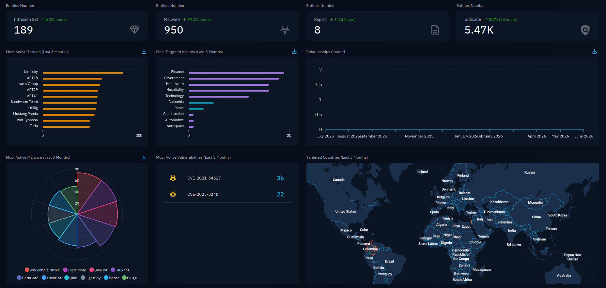
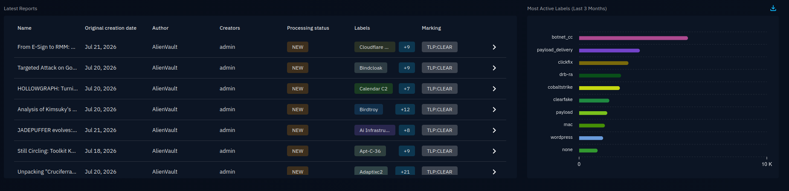
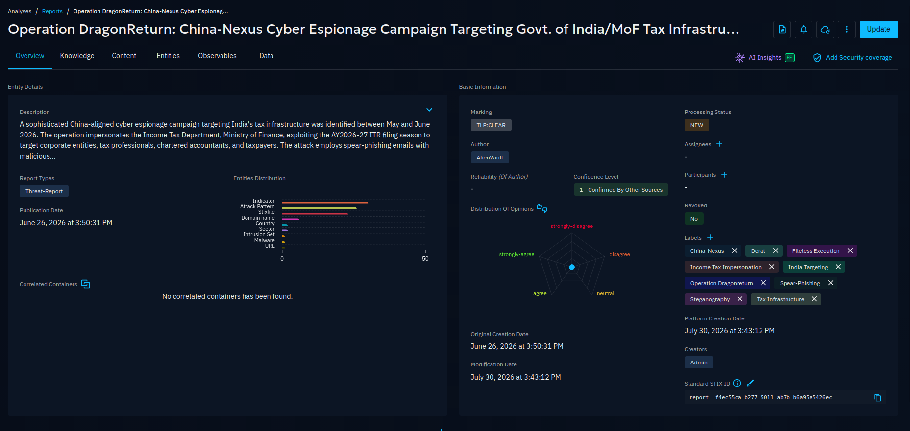
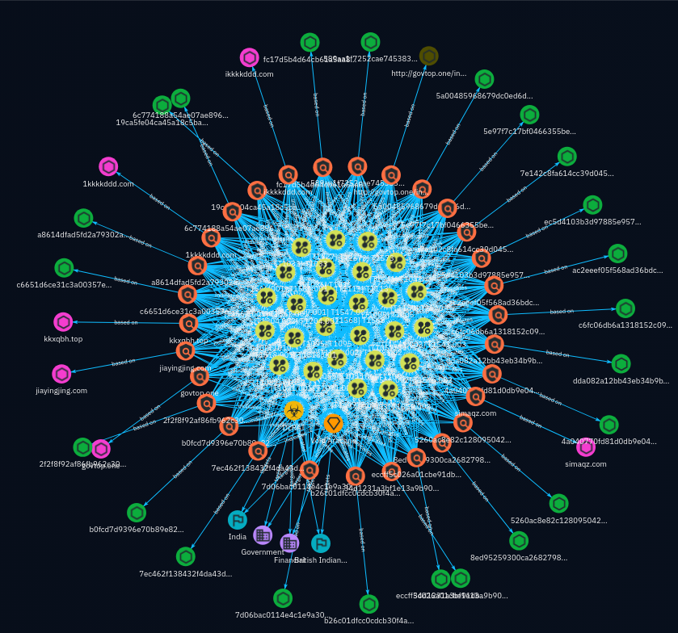
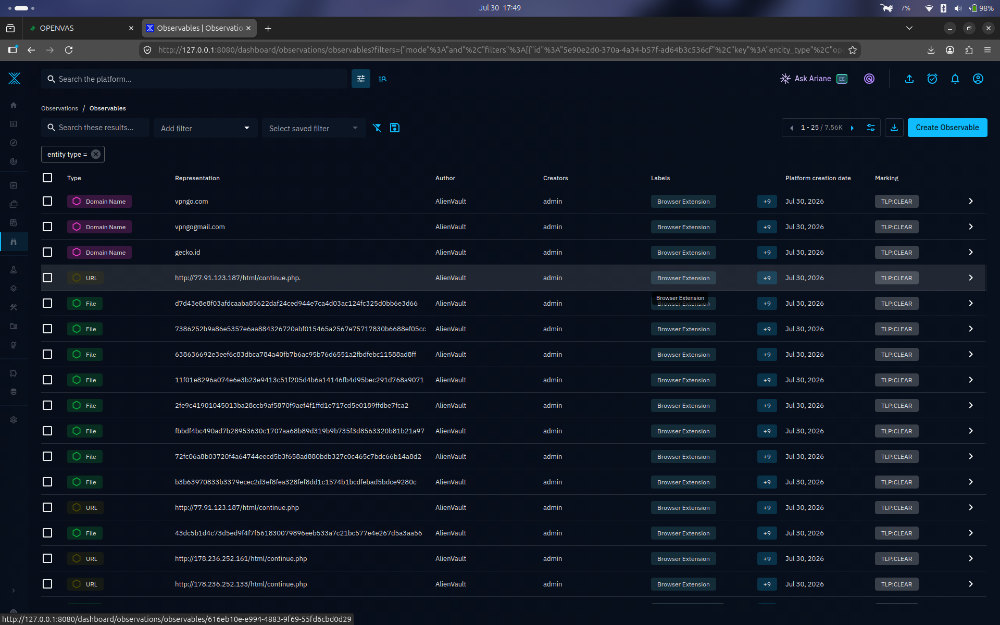
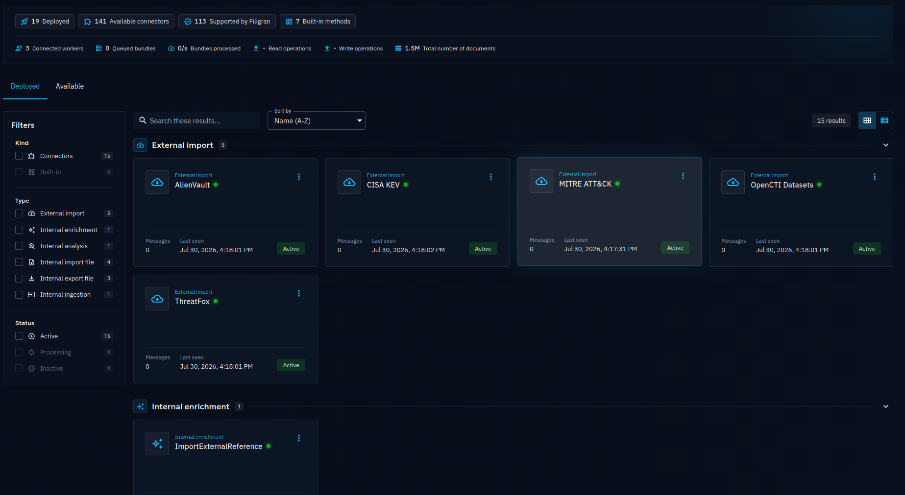

# From Empty Dashboard to Live Intel: Standing Up OpenCTI

> **Scope note.** Week 4, part 1: deploy OpenCTI, understand its architecture, and
> feed it with real threat intelligence. The interesting part isn't the install —
> it's that a fresh OpenCTI is *empty by design*, and turning it into something
> useful means understanding the connector model and debugging the feeds that break.

---

## 1. Purpose and Scope

This report documents the "deploy and review OpenCTI" task. The work has two phases:
(1) deploying OpenCTI with Docker Compose and grasping its core architecture, and
(2) reviewing the platform once it's fed with real threat-intelligence sources —
through the dashboard, the report (case) structure, the knowledge graph, and the
observable/indicator data model.

During deployment, the official OpenCTI Docker repo was found to bundle separate
products from the same company (Filigran) — XTM One, OpenAEV, OpenGRC — in the same
compose file. These extra products were left out of scope, and only OpenCTI's core
services (platform, worker, connectors) were deployed. This was a scope/resource
decision, unrelated to the missing-data problem discussed below.

---

## 2. OpenCTI Architecture — A Quick Reminder

OpenCTI is a Threat Intelligence platform built on the STIX2 standard with a connector
architecture. The platform itself provides a "skeleton" (a knowledge-graph engine +
interface); data flows in *only* through connected connectors. This is the root cause
of the "initially empty dashboard" situation below: every fresh OpenCTI install is
empty until a data source is connected — that's not an install error, it's the
platform's design philosophy.

| Component | Role |
| :--- | :--- |
| Elasticsearch | Search/storage engine indexing all STIX2 objects (Indicator, Malware, Report, …) |
| RabbitMQ | Message system queuing data from connectors (async processing) |
| Redis | Cache and real-time event stream |
| MinIO | Object store for uploaded files (reports, STIX bundles) |
| Worker + Connectors | Independent services that import (pull data) and enrich it |

---

## 3. Connector Integration — Real Data Sources

On first review, many dashboard widgets (Report, Indicator, Most Active
Vulnerabilities, Most Targeted Victims) were in a "No data has been found" state. Root
cause analysis showed only `connector-mitre` (the static MITRE ATT&CK taxonomy) was
running; no incident/case-based real data (Report, Indicator) was connected at all. To
feed the platform with live intelligence, three additional free connectors (needing no
API key, or one obtained via a free registration) were integrated:

| Connector | Source | Data provided | Problem / fix |
| :--- | :--- | :--- | :--- |
| ThreatFox | abuse.ch | 4,320+ real, current malicious IP/domain/hash (Indicator + Observable) | Worked without issue |
| CISA KEV | CISA (US gov) | 470 actively exploited CVEs (Vulnerability) | cisa.gov's bot protection returned 403 Forbidden; fixed by pointing to the official GitHub mirror (`cisagov/kev-data`) |
| AlienVault OTX | AlienVault (free account) | Real analysis reports, plus a chain of related Indicator/Malware/Attack Pattern/Vulnerability | The default `ALIENVAULT_PULSE_START_TIMESTAMP` (2020) caused an infinite loop from the huge data volume; fixed by pulling the start date to a recent window |

Additionally, `connector-mitre` was found to be still using an old API token that
became invalid when the OpenCTI admin password was reset, dropping it to "Exited (1)".
Recreating the container with `--force-recreate` made it pick up the current token and
brought it back online. This is a practical finding that connectors don't automatically
pick up `.env` changes — they must be recreated.

After integration, the Data → Ingestion → Connectors page confirmed 1.5 million total
documents processed and all 6 connectors (AlienVault, CISA KEV, MITRE ATT&CK, OpenCTI
Datasets, ThreatFox, ImportExternalReference) in the "Active" state.

---

## 4. Dashboard Review

After the connectors were integrated, the platform's main Dashboard was reviewed. The
Report and Indicator counts, initially 0, rose to 8 and 5.47K respectively; the "No
data" Most Active Vulnerabilities, Most Targeted Victims, and Targeted Countries widgets
filled with real data.

*The dashboard, now populated: threat actors, targeted sectors, CVEs, and geography.*

*Latest reports and most-active labels, pulled from AlienVault OTX.*

The `CVE-2021-34527` seen in the Most Active Vulnerabilities widget is the critical
Windows Print Spooler remote-code-execution vulnerability publicly known as
"PrintNightmare"; the high relationship count (36) indicates it is still being actively
reported/exploited. This aligns with EPSS logic (the probability a vulnerability is
actively exploited).

---

## 5. Case (Report) Review — A Worked Example

One of the platform's real reports was opened to examine OpenCTI's Report (Container)
structure. The report examined is titled *"Operation DragonReturn: China-Nexus Cyber
Espionage Campaign Targeting Govt. of India / MoF Tax Infrastructure"* and documents a
sophisticated, China-nexus cyber-espionage campaign targeting India's tax infrastructure.

Per the report's description: detected between May and June 2026, the operation
impersonates India's Income Tax Department (Ministry of Finance), exploiting the
AY2026-27 tax-filing season to target corporate entities, tax professionals, chartered
accountants, and taxpayers. The attack begins with spear-phishing emails carrying
malicious attachments that mimic legitimate government tools. The multi-stage infection
chain deploys DcRAT via steganography-hidden payloads, fileless .NET execution, AMSI
bypass, and Windows service persistence. The threat actor's operational maturity is
shown by achieving a 0/66 detection rate through active payload rotation, encrypted
TLS-based C2, and infrastructure spread across multiple China-associated ASNs. The
campaign is noted as overlapping with the China-linked Silver Fox threat actor, with
screen-capture, data-exfiltration, and systematic intelligence-collection capabilities
against high-value Indian targets.

*The report's Overview: metadata, entities distribution, and labels.*

In the Entities Distribution chart, Indicator being the tallest bar shows the report
contains many concrete, actionable indicators. Attack Pattern also being prominent
(near Stixfile) indicates that, unlike previously reviewed reports, this campaign is
richly documented at both the technical-IOC and TTP level. The empty Correlated
Containers area ("No correlated containers has been found") shows this case isn't yet
linked to another report in the platform's knowledge base — it's tracked as a separate
campaign. Labels like DcRAT, Steganography, and Fileless Execution confirm the attack
uses advanced defense-evasion techniques.

---

## 6. Knowledge Graph — Relationship Analysis

Using the same "Operation DragonReturn" report, OpenCTI's Knowledge (graph) view was
examined. This view visualises all the report's entities (Indicator, Observable, Malware,
Country, Sector, Attack Pattern) as a node-link graph.

*The campaign's entities as a node-link graph — IOCs and TTPs side by side.*

This makes the difference between IOC (static indicators — domain, hash) and TTP
(behavioural indicators — MITRE Technique) concretely visible on the platform. A domain
name can change over time, whereas tracking a technique like T1543.003 (persistence via a
Windows service) as a detection rule is a far more durable approach defensively.

---

## 7. Observable / Indicator Data Model

On the Observations → Observables page, 7,560 observable records were examined. Records
group into three main types: Domain Name, URL, and File (represented by a SHA-256 hash).
In the example examined, many File observables were found associated with fake domain
names impersonating a legitimate VPN service (`vpngo.com`, `vpngogmail.com`); this pattern
points to a "malware distribution via fake software/browser extension" scenario (all
records carrying the "Browser Extension" label supports this).

*7,560 observables across Domain/URL/File types — the raw "this was seen" layer.*

This clarified the conceptual difference between an Observable (a raw observation — "this
was seen") and an Indicator (a judgement — "this should be treated as malicious"): an
Observable alone carries no threat claim, but becomes actionable when paired with a
related Indicator object.

---

## 8. Connector Health — Overall Status

At the end, the health of all integrations was assessed together from the Data →
Ingestion → Connectors page.

*All connectors Active; 1.5M documents processed.*

| Connector | Status | Note |
| :--- | :--- | :--- |
| MITRE ATT&CK | Active | Static taxonomy; crashed once during setup on a token issue, fixed by recreating |
| ThreatFox | Active | 4,320+ IOCs, auto-refresh every 3 days |
| CISA KEV | Active | 470 CVEs, daily refresh (via GitHub mirror) |
| AlienVault OTX | Active | Real Report/relationship data, refresh every 30 minutes |
| OpenCTI Datasets | Active | Built-in dataset shipped with the platform |
| ImportExternalReference | Active | Internal enrichment connector |

---

## 9. Conclusion

In this work, OpenCTI was deployed, its architecture understood, and four independent
real threat-intelligence sources (MITRE ATT&CK, abuse.ch ThreatFox, CISA KEV, AlienVault
OTX) were integrated — transforming the platform from a passive taxonomy store into an
active, current intelligence platform. Through the review, the platform's core functions
were learned hands-on via the Dashboard, the Report/Container structure, the Knowledge
Graph relationship visualisation, and the Observable/Indicator data model.

The technical problems encountered and solved along the way (YAML indentation errors,
CISA's bot protection, AlienVault stalling on data volume, connector token invalidation)
are the class of problems frequently met in running a real CTI platform, and solving them
systematically (log review, root-cause analysis, verification) is a practical
demonstration of "real-world CTI operations."

One note for evaluation: deliberately excluding the extra products (XTM One / OpenAEV /
OpenGRC) from the official Docker repo was a separate scope/resource decision, unrelated
to the missing-data problem. Every fresh OpenCTI install is — until a connector is
connected — empty by nature; this work also demonstrates how to move the platform from an
"empty install" state to a "productive, real-data-fed platform" state.
