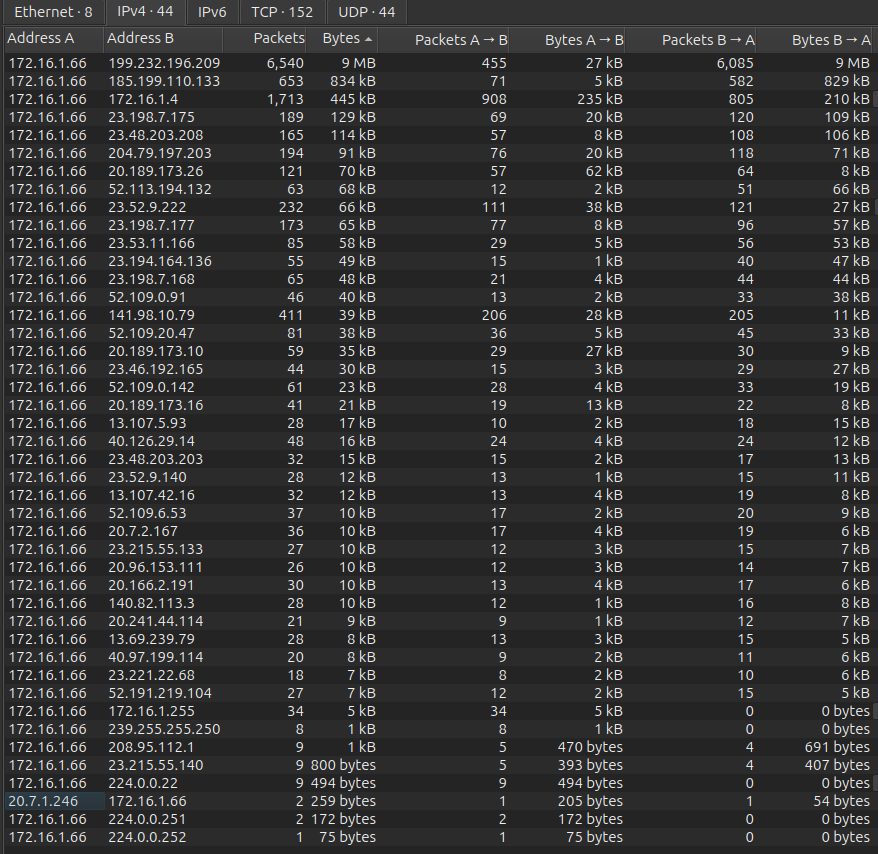
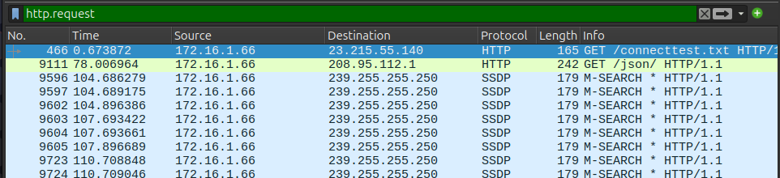
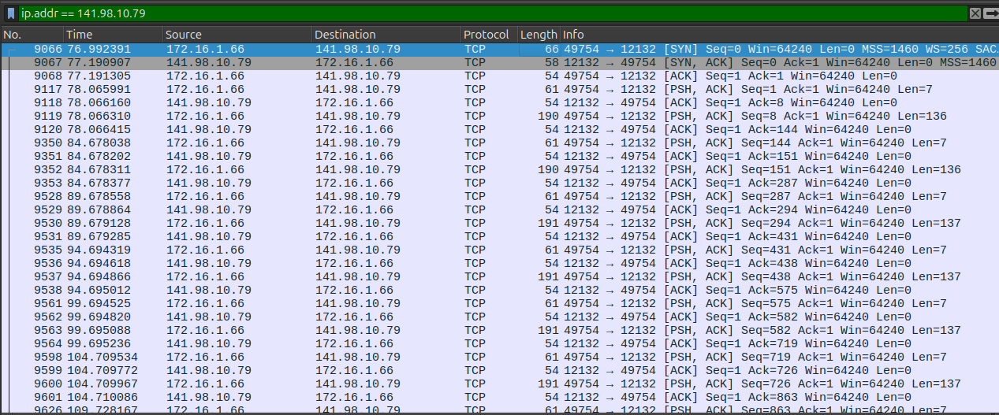
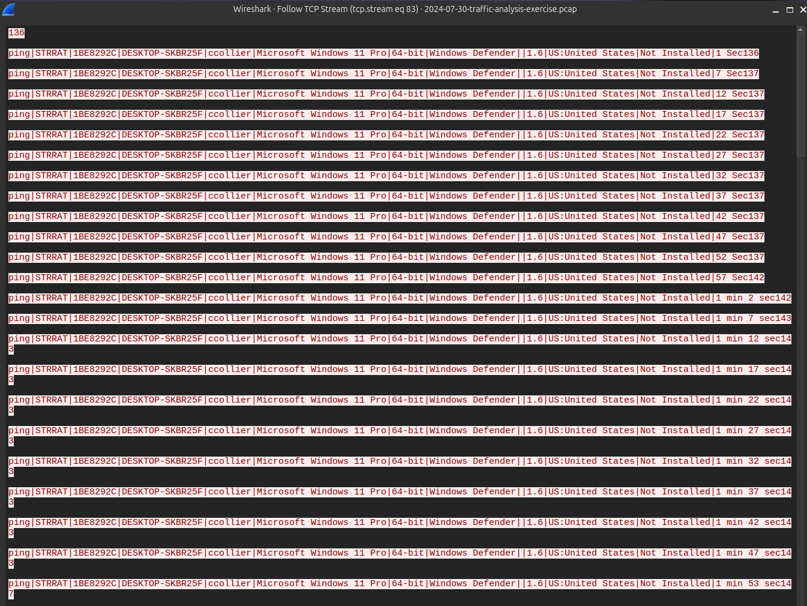
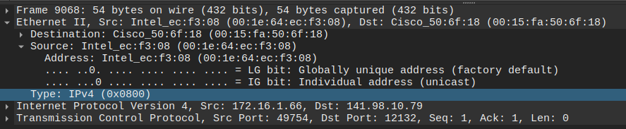
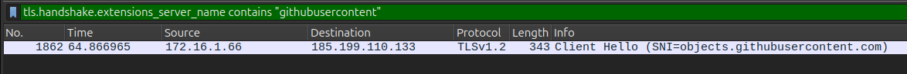
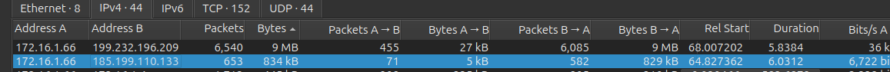
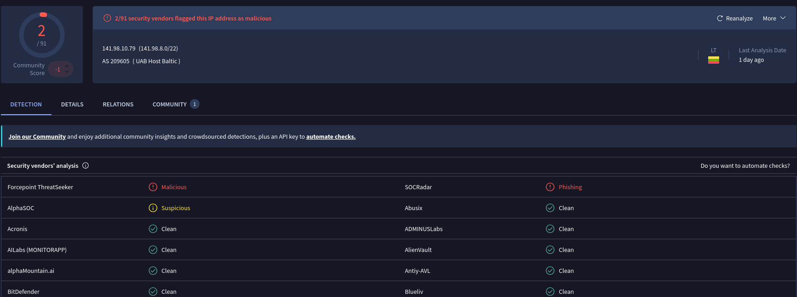
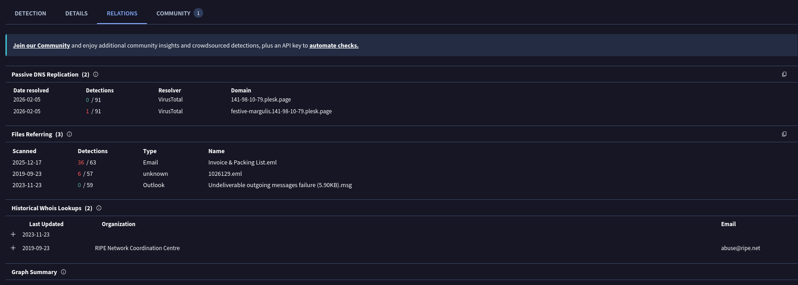

# Hunting a STRRAT C2 Channel in a PCAP

> **Scope note.** This is a documented walkthrough of a public training exercise
> from malware-traffic-analysis.net. The value here is not the answer key — it is
> the reasoning path: which filter was applied, why it was chosen, and what each
> result eliminated.

---

## 1. Starting Position

I began with a single network capture and the scenario metadata below. Whether an
infection existed at all, which host was affected, and how it happened were all
unknown at the start — every finding below was derived from the traffic.

| Given information | Value |
| :--- | :--- |
| LAN segment | `172.16.1.0/24` |
| Domain | `wiresharkworkshop.online` |
| Domain Controller | `172.16.1.4` (WIRESHARK-WS-DC) |
| Gateway | `172.16.1.1` |
| Analysis platform | Wireshark on Ubuntu 24.04 |

**Objective:** Is there malicious activity in this capture? If so, which host was
affected, how did the attack unfold, and what indicators of compromise can be
extracted?

---

## 2. The Investigation

### Step 1 — Establish the shape of the traffic

Inspecting thousands of packets individually is not a strategy. The first move is
to see the traffic's overall shape, so I opened **Statistics → Conversations** and
switched to the **IPv4** tab. IPv4 is the right layer for the opening question —
"who is talking to whom?" is an L3 question.

Sorted by `Bytes`, one internal address sat on one end of effectively every
conversation: **`172.16.1.66`**. Other internal hosts (including the domain
controller at `172.16.1.4`) appeared only a handful of times.

> **Finding:** The host under observation is `172.16.1.66` — inside the given
> `/24`, and the source of all outbound traffic.

One row stood out for the *wrong* reason. External IP `141.98.10.79` carried
**411 packets but only ~39 kB** — roughly 95 bytes per packet. By contrast, the
highest-volume peer (`199.232.196.209`) averaged ~1400 bytes per packet. Many
small, repetitive packets is the signature shape of a C2 **beacon**.


*Conversations view. Note `141.98.10.79`: 411 packets for only 39 kB.*

> ⚙ **Methodology note.** Being an external IP does not make an address
> suspicious — a host browsing the internet talks to dozens of them. The
> discriminator is the *traffic pattern*. At this stage `141.98.10.79` is a
> candidate, not a conclusion; confirming it requires looking at content.

---

### Step 2 — Rule out cleartext delivery

Malware is frequently pulled over plain HTTP, and when it is, the content is
readable. Testing that possibility costs one filter:

```
http.request
```

The result was entirely benign: a Windows connectivity test (`connecttest.txt`),
an IP-lookup service (`/json/`), and local SSDP discovery. `141.98.10.79` did not
appear at all.


*No malicious HTTP. The interesting traffic is elsewhere.*

> **Finding:** Malicious communication is not running over HTTP. It is either
> TLS-encrypted or using a custom protocol — which redirects the search.

---

### Step 3 — Characterise the candidate: port and rhythm

To see what kind of traffic the candidate IP actually produced, I isolated it:

```
ip.addr == 141.98.10.79
```

The first three packets were a textbook TCP three-way handshake (SYN →
SYN,ACK → ACK), so the connection was genuinely established. The protocol column
read plain **TCP** — not HTTP, not even TLS. The Info column showed
`49754 → 12132`: `49754` is the victim's ephemeral port, **`12132` is the port the
server is listening on**.

The flow had a rhythm: the victim sent a small message (`Len=7`), the server
answered with 136–137 bytes, and this repeated steadily.


*Raw TCP on port 12132, with a visible beacon cadence.*

> **Finding:** Non-standard port + regular small-message exchange +
> victim-initiated persistent outbound connection = strong C2 suspicion. This is
> now an observation-backed inference rather than a guess.

> ⚙ **Methodology note.** Legitimate services use well-known ports (80, 443, …).
> Arbitrary high ports like 12132 are common in C2 infrastructure — not
> disqualifying on their own, but corroborating alongside the packet pattern.

---

### Step 4 — Read the content: the breaking point

To settle the question, I right-clicked one of the `141.98.10.79` rows and chose
**Follow → TCP Stream**. Because the traffic was unencrypted, the entire
conversation came back as plaintext — and the malware identified itself:

```
ping|STRRAT|1BE8292C|DESKTOP-SKBR25F|ccollier|Microsoft Windows 11 Pro|64-bit|Windows Defender|...|1.6|US:United States|...
```

That single line answered several questions at once: malware family
(**STRRAT v1.6**), hostname (**DESKTOP-SKBR25F**), Windows user (**ccollier**),
operating system, and installed AV. The beacon repeated roughly every 5 seconds.

Later messages carried Base64-encoded fields — `RG9jdW1lbnRz` → `Documents`,
`UGljdHVyZXM=` → `Pictures`. These are the titles of windows open on the victim's
screen, reported back to the C2: surveillance/keylogging behaviour.


*The malware names itself in its own beacon.*

> **Finding:** `141.98.10.79:12132` is definitively a STRRAT C2 server. The
> evidence is not external intelligence — it is the string `STRRAT` inside the
> traffic itself.

---

### Step 5 — Complete the victim profile (MAC address)

The only field still missing from the victim details was the MAC address. I
filtered on the victim and opened the **Ethernet II** layer in the packet detail
pane:

```
ip.addr == 172.16.1.66
```

On a packet *leaving* the victim, `Source MAC = 00:1e:64:ec:f3:08` (the `00:1e:64`
OUI belongs to Intel). The destination MAC belonged to the gateway — the
destination was on the internet, so the frame goes to the local router first.


*Source MAC read from an outbound frame; note Dst Port 12132 on the same packet.*

> ⚙ **Methodology note.** MAC addresses are only meaningful on the local segment
> and are rewritten at each router hop. The victim's own MAC must be read from the
> **Source** field of a packet *originating* at the victim.

---

### Step 6 — Find the delivery vector

C2 activity was established, but *initial access* was not. The first hypothesis
was email. Testing cleartext mail protocols:

```
smtp || pop || imap
```

**Zero packets.** The mail did not arrive over a plaintext protocol — and since
`outlook.com` / `office.com` appeared in the TLS SNI list, email traffic was
encrypted and unreadable from this capture.

> ⚙ **Methodology note.** Finding nothing *is* a finding. This elimination proves
> the delivery channel was encrypted and cannot be recovered from the PCAP,
> which justifies changing approach rather than repeating the same query.

So I changed strategy: delivery must precede the C2 connection (first SYN at
~76.99 s). I listed TLS handshakes before that moment:

```
frame.time_relative < 77 && tls.handshake.type == 1
```

Among the Microsoft/Windows telemetry noise, two consecutive names stood out:
`github.com`, immediately followed by `objects.githubusercontent.com` (GitHub's
raw file host), then `repo1.maven.org` — all of it just before the C2 connection.

Isolating the GitHub content connection:

```
tls.handshake.extensions_server_name contains "githubusercontent"
```

Timestamp **64.87 s** (before the C2), destination **185.199.110.133**. Measuring
total traffic to that IP in Conversations gave **~834 kB** — file-sized, not
page-sized.


*The Client Hello at 64.87 s — 12 seconds before the C2 connection.*


*834 kB transferred — consistent with a downloaded JAR, not a web page.*

> **Finding:** ~12 seconds before the C2 connection, a ~834 kB file was downloaded
> via GitHub. Size, timing, and GitHub's known abuse for malware staging together
> make the STRRAT payload (a JAR) the strong hypothesis. The traffic is
> TLS-encrypted, so the file's contents could **not** be directly verified.

---

### Step 7 — Timeline correlation: what actually belongs to the attack

The SNI list also contained `javadl-esd-secure.oracle.com` (Java runtime download)
and `repo1.maven.org` (Java library repository). STRRAT is Java-based, so
attributing both to the malware was tempting — but that would be an assumption.
The disciplined approach is to order events relative to the C2 connection.

| Time (s) | Event | Relative to C2 | Assessment |
| ---: | :--- | :--- | :--- |
| 64.87 | GitHub payload (`185.199.110.133`) | ~12 s before | Part of the chain |
| 68.05 | Maven (`repo1.maven.org`) | ~9 s before | Consistent — dependency fetch |
| 76.99 | First C2 connection (`141.98.10.79`) | reference | STRRAT comes online |
| 340.55 | Java/Oracle (`javadl-...oracle.com`) | ~4.5 min after | Not attributable |

> **Finding:** Maven traffic precedes the C2 and is consistent with STRRAT loading
> its Java dependencies. The Oracle/Java download occurred 4.5 minutes *after* C2
> establishment and is therefore **not** linked to the infection chain — merely
> being present in the capture is not grounds for attribution.

> ⚙ **Methodology note.** A domain appearing in traffic and a domain belonging to
> the attack are different claims. What converts observation into evidence is
> temporal correlation.

---

### Step 8 — Independent corroboration

Finally, I checked whether the internally derived C2 IP was known to external
threat intelligence. Querying `141.98.10.79` on VirusTotal: **2 of 91 engines**
flagged it (Forcepoint: *Malicious*; SOCRadar: *Phishing*; AlphaSOC: *Suspicious*;
Community Score −1). The IP is hosted by **UAB Host Baltic (AS209605, Lithuania)**.


*2/91 — low, but not zero, and the hosting provider is consistent with the picture.*

> ⚙ **Methodology note.** IP reputation detection rates run much lower than file
> detection rates: C2 IPs are short-lived and most engines do not track IP
> reputation continuously. A clean IP would return 0/91 — two engines calling it
> malicious/phishing plus suspicious hosting is a meaningful signal. The
> **primary** evidence remains the STRRAT stream in the PCAP.

The **RELATIONS** tab added context: `plesk.page` domains resolving to this IP via
passive DNS, and an associated email file named **"Invoice & Packing List.eml"**
flagged by 36/63 engines — a classic phishing lure theme matching STRRAT's typical
malspam distribution.


*Passive DNS and file relations for the C2 IP.*

> **Important limit.** This email does **not** appear in our PCAP; it is a global
> association in VirusTotal. We therefore cannot claim "the victim opened this
> email" — only that delivery via phishing is *consistent* with this relationship.

---

## 3. Summary of Findings

### 3.1 Executive Summary

A Windows 11 workstation (**DESKTOP-SKBR25F**, user **ccollier**) on the monitored
`172.16.1.0/24` network was infected with **STRRAT**, a Java-based Remote Access
Trojan, for the duration of the capture. At ~64 s the host downloaded a probable
payload via GitHub, at ~68 s it pulled Java dependencies from Maven, and at ~77 s
it connected to a C2 server at **`141.98.10.79:12132`** and began regular beaconing.
STRRAT reported the victim's active window titles back to the C2, demonstrating
surveillance behaviour.

### 3.2 Victim Details

| Field | Value | How it was found |
| :--- | :--- | :--- |
| IP address | `172.16.1.66` | Step 1 (Conversations) |
| MAC address | `00:1e:64:ec:f3:08` (Intel) | Step 5 (Ethernet II) |
| Hostname | `DESKTOP-SKBR25F` | Step 4 (C2 stream) |
| Windows user | `ccollier` | Step 4 (C2 stream) |
| Operating system | Windows 11 Pro (64-bit) | Step 4 (C2 stream) |

### 3.3 Indicators of Compromise

| IOC | Value | Type | Verification / source |
| :--- | :--- | :--- | :--- |
| C2 IP | `141.98.10.79` | IPv4 | Step 4 + VT 2/91 |
| C2 port | `12132` | TCP port | Step 3 (non-standard) |
| C2 domain | `141-98-10-79.plesk.page` | Domain | VT passive DNS |
| C2 domain | `festive-margulis.141-98-10-79.plesk.page` | Domain | VT passive DNS |
| Payload source | `objects.githubusercontent.com` (`185.199.110.133`) | Domain / IPv4 | Step 6 |
| Malware | STRRAT v1.6 | Malware family | Step 4 (C2 stream) |
| Related phishing | `Invoice & Packing List.eml` | Email | VT relations 36/63 |

> ⚙ **On the missing hash.** The malware binary was delivered over TLS, so it
> could not be carved from the PCAP and no file hash was obtained. This falls
> under the exercise's "*if any malware binaries can be extracted*" condition.

---

## 4. MITRE ATT&CK Mapping

Each technique below is tied to the analysis step that produced the evidence for it.

| Tactic | Technique (ID) | Basis (analysis step) |
| :--- | :--- | :--- |
| Initial Access | Phishing (T1566) | Step 8 — VT phishing relation (*probable*; delivery not in PCAP) |
| Execution | User Execution: Malicious File (T1204.002) | Step 6 — C2 activity following payload download |
| Execution | Command and Scripting Interpreter (T1059) | Step 7 — Java/Maven dependency loading |
| Command & Control | Application Layer Protocol (T1071) | Steps 3–4 — `141.98.10.79:12132` beacon |
| Command & Control | Ingress Tool Transfer (T1105) | Step 6 — ~834 kB download from GitHub |
| Collection | Screen / Input Capture (T1113, T1056) | Step 4 — Base64 window titles |
| Discovery | System Information Discovery (T1082) | Step 4 — OS/host/user/AV sent to C2 |

> ⚙ **Methodology note.** The *Initial Access — Phishing* mapping is marked
> **probable** because it was not directly observed in the PCAP; confirming it
> requires email gateway or endpoint logs. Every other technique rests on direct
> traffic evidence.

---

## 5. APT Context: Comparison with APT28 (Fancy Bear)

> **Attribution note.** The analysed sample is commodity malware (STRRAT) and is
> **not** attributed to APT28. The comparison below illustrates how the observed
> techniques overlap with a nation-state group's repertoire.

| Technique | In this case (STRRAT) | APT28 (G0007) usage |
| :--- | :--- | :--- |
| Phishing (T1566) | Probable malspam delivery | Spearphishing (attachment + link) — primary vector |
| App Layer C2 (T1071) | Custom TCP on `141.98.10.79:12132` | C2 via X-Agent / X-Tunnel |
| Ingress Tool Transfer (T1105) | Payload staged on GitHub | Second-stage tool download |
| Collection (T1113) | Window title capture | Screen capture / keylogging (X-Agent modules) |

**Assessment:** STRRAT serves functionally similar goals to APT28's X-Agent —
remote control, data collection, C2. The difference is tradecraft: APT28 fields
custom-built, stealthier tooling, while STRRAT is a commodity threat spread via
malspam. This case illustrates that APT-grade *techniques* are equally observable
in commodity malware.

---

## 6. Recommendations

1. **Isolate** the affected host (`172.16.1.66` / DESKTOP-SKBR25F) from the network immediately.
2. **Block** the C2 IP (`141.98.10.79`) and the associated `plesk.page` domains at the perimeter firewall/proxy.
3. **Reset credentials** for user `ccollier` and revoke active session tokens.
4. **Review email gateway and EDR logs** to confirm initial access — hunt for phishing with an "Invoice & Packing List" theme.
5. **Hunt laterally** for connections to the same C2 IP from other hosts on the network.
6. **Operationalise the IOCs** as detection rules in the SIEM (e.g. Wazuh), with monitoring for T1071 and T1105.
